# System Requirements Specification (SRS)

## 1. Document Control

| Field | Value |
|---|---|
| Product | Peach Finder |
| Document | System Requirements Specification |
| Owner | Kumbirai (kumbirai@gmail.com) |
| Upstream | `documentation/00-business-requirements/brd.md` (BRD), `documentation/01-functional-requirements-specification/frs.md` (FRS — signed-off baseline) |
| Downstream | `03-user-stories`, `04-solution-architecture`, `05-low-level-design` |
| Status | Living document — updated in place as decisions evolve; see repo history for change record |

**Requirement ID convention:** `SR-<CATEGORY>-<NN>`. Priorities follow MoSCoW as in the FRS: **M** (Must for V1 launch), **S** (Should — launch window), **C** (Could — fast-follow), **W** (Won't in V1).

**What this document is:** the system-level requirements the platform must satisfy to deliver the FRS — deployment and infrastructure constraints, external interfaces, data and storage requirements, quantified performance/capacity/availability targets, security, privacy, and operability. It specifies *what the system must be capable of*, in measurable terms. Technology **selection** (language, framework, database product, providers) belongs to `04-solution-architecture`, except where a technology is a mandated constraint (§4).

**Moderation stance (inherited, binding):** moderation is a **human function with no system gating** (FRS §1). No requirement in this document introduces automated content analysis, filtering, scanning, or any system gate between a provider's action and their content being live. Upload validation in this document (§8) is strictly *technical* — file type, size, and decodability — never content judgment. Security and rate-limiting controls (§11) protect the platform from robots and abuse of *system resources*; they never act on the meaning of content.

---

## 2. System Overview & Context

Peach Finder V1 is a **mobile-first responsive web application** (no native apps) serving four human actor classes — anonymous seeker, seeker, provider, admin — plus automated system behavior (badge computation, ranking, billing lifecycle, notifications).

### 2.1 System context

```mermaid
flowchart LR
    U[Seekers & Providers<br/>mobile-first browsers] -->|HTTPS| CF[Cloudflare<br/>DNS · CDN · WAF · DDoS]
    A[Admins] -->|HTTPS| CF
    CF -->|proxied origin pull| VPS

    subgraph VPS [Ubuntu Linux VPS — Docker]
        WEB[Web/App tier<br/>SSR + API + WebSocket]
        DB[(Primary datastore)]
        MINIO[(MinIO<br/>S3-compatible object store)]
        JOBS[Scheduled jobs<br/>& async workers]
        WEB --- DB
        WEB --- MINIO
        JOBS --- DB
        JOBS --- MINIO
    end

    WEB --> EMAIL[Transactional email provider]
    WEB --> SMS[SMS/OTP provider]
    WEB --> PAY[Payment service provider<br/>platform fees only]
    WEB --> OAUTH[OAuth identity providers]
    WEB --> PUSH[Web-push service]
    VPS --> BK[Off-host backup storage]
```

### 2.2 Actor–system access summary

| Actor | Entry path | Transport |
|---|---|---|
| Anonymous seeker | Public web (homepage, search, profiles) | HTTPS via Cloudflare |
| Seeker / Provider | Public web + authenticated session; near-real-time messaging channel | HTTPS + WebSocket (fallback per SR-APP-08) via Cloudflare |
| Admin | Admin console (separate authenticated surface, SR-SEC-08) | HTTPS via Cloudflare |
| System | Internal scheduled jobs and workers (SR-APP-10) | Internal to VPS |

---

## 3. External Interfaces (INT)

Every integration below is a **replaceable commodity interface** — the system must isolate each behind an internal abstraction so a provider swap is a configuration/adapter change, not a redesign.

- **SR-INT-01 (M): Transactional email.** The system sends account, billing, moderation-outcome, and notification email (FR-NOTIF-01) through a transactional email provider over an authenticated API. Sending domain must carry valid **SPF, DKIM, and DMARC** records; bounces and spam complaints are captured and surfaced operationally (SR-OBS-04). Email delivery is asynchronous (queued, retried with backoff) — a provider outage must never block the user-facing action that triggered the email.
- **SR-INT-02 (M): SMS OTP.** Provider phone verification (FR-ACC-03) uses an SMS provider with reliable delivery to the launch market. OTPs: 6 digits, single-use, expire ≤ 10 minutes, max 5 verification attempts per code. Send limits: ≤ 3 codes per phone number per hour and ≤ 10 per day; per-IP limits per SR-SEC-10. Cumulative SMS spend is metered with an alert threshold (SR-OBS-04) — OTP abuse is a direct cost attack.
- **SR-INT-03 (M): Payment service provider (platform fees only).** Listing and featuring fees (FR-MONET) are processed by an external PCI DSS–compliant PSP using hosted/tokenized card capture, keeping the platform at **SAQ-A scope: card data never touches Peach Finder servers** (FR-MONET-06). The integration must support: recurring monthly charges, retry on failure, webhooks for payment outcomes (verified by signature, idempotently processed), refunds issued from the PSP dashboard, and itemized receipt data. Webhook processing drives the FR-MONET-04 lapse lifecycle.
- **SR-INT-04 (M): OAuth sign-in.** Seeker registration/sign-in supports at least **Google** OAuth at launch (FR-ACC-02); Apple **(S)**. OAuth is additive — email+password always remains available. OAuth account linking is by verified email match with explicit user confirmation.
- **SR-INT-05 (S): Web push.** Web-push notifications (FR-NOTIF-01, S-priority channel) via the standard Web Push API (VAPID). Push failure silently falls back to the email/in-app baseline.
- **SR-INT-06 (M): Geo/area data.** Proximity search (FR-SRCH-06) and area-level provider locations (FR-PROF-04) require a gazetteer of areas/suburbs/neighborhoods for the launch market, each with a representative centroid. The source must be locally cached/owned data — proximity ranking must not depend on a paid per-query geocoding API on the search hot path. Device "near me" coordinates are used transiently (FR-PRIV-02) and never persisted.
- **SR-INT-07 (M): Cloudflare.** All public DNS is Cloudflare-managed and **proxied** (no direct-to-origin records for web traffic). Required Cloudflare functions: DDoS mitigation, WAF with managed rules, TLS termination at edge with **Full (strict)** origin encryption, edge caching for static assets and public media, and edge rate-limiting rules on authentication/OTP endpoints (defense-in-depth ahead of SR-SEC-10). See SR-SEC-02 for origin lockdown.

---

## 4. Mandated Platform Constraints (CON)

These are fixed inputs from the product owner (2026-07-22), not open architecture questions:

- **SR-CON-01 (M):** Production runs on a single **Ubuntu Linux LTS VPS** (current LTS at build time; security patches applied per SR-OPS-06). V1 does not require multi-node clustering; growth is met first by vertical scaling (SR-CAP-04).
- **SR-CON-02 (M):** All application components run as **Docker containers** on that VPS, defined declaratively (compose file or equivalent, version-controlled). Nothing application-level is installed directly on the host beyond Docker, the firewall, and the backup agent. Containers restart automatically on failure and on host reboot.
- **SR-CON-03 (M):** The platform sits **behind Cloudflare** for DDoS mitigation, WAF, TLS, and CDN (SR-INT-07). The origin accepts web traffic only from Cloudflare (SR-SEC-02).
- **SR-CON-04 (M):** Images and user-uploaded media are stored in a **local S3-compatible object store (MinIO)** running on the VPS (§8) — not on the application filesystem and not in the database.
- **SR-CON-05 (M):** The web experience is responsive web only — no native mobile apps, no localization (BRD §6.2). English UI at launch.

---

## 5. Application Platform Requirements (APP)

System capabilities the FRS implies but does not specify — the behaviors that make the functional requirements physically work.

- **SR-APP-01 (M): Server-side rendering of public surfaces.** Homepage, search results, and provider profiles render meaningful HTML server-side (FR-UX-08): correct link-preview metadata (FR-PROF-11), crawlability, and fast first paint on low-end devices. Authenticated app surfaces may be client-rendered.
- **SR-APP-02 (M): Deterministic natural-language query interpretation.** The free-text search translation (FR-SRCH-02) is a **deterministic, lexicon-driven parser**: a maintained vocabulary of service terms (seeded from the FR-PROF-03 tag vocabulary), language names, and intent phrases (availability, rating, verification, proximity) maps query tokens to structured filters. Identical query + filters + location must produce identical results for every user (FR-SRCH-13) — no per-user models, no learning ranker, no external LLM call on the search path. The lexicon (synonyms, phrase → intent mappings) is admin-maintainable data (SR-APP-11), so interpretation improves without deployment.
- **SR-APP-03 (M): Search index.** Discovery queries (text relevance over introduction/services, tag filtering, language/price/rating/verified filters, area distance, availability-recency ordering, featured boost) execute against an index that satisfies the SR-PERF budgets at SR-CAP-01 scale. Index updates from profile/availability changes are visible in search within **≤ 30 seconds**. The availability-first ordering rule (FR-SRCH-03) and featured-never-outranks-available rule (FR-SRCH-08c) are enforced in ranking logic at query time, not left to relevance scoring.
- **SR-APP-04 (M): Availability signal integrity.** "Available now" state transitions (set, renew, clear, auto-expire) are timestamped in UTC and take effect on all discovery surfaces within ≤ 30 seconds (SR-APP-03) and within the cache-freshness bound (SR-PERF-06). Auto-expiry (FR-AVAIL-03) is enforced by a scheduled sweep running **at least every minute** — an expired status must never survive longer than expiry + 60 s.
- **SR-APP-05 (M): Near-real-time messaging transport.** Message delivery (FR-MSG-02) uses a persistent server-push channel (WebSocket or equivalent) with automatic reconnection; **fallback to polling** when the persistent channel cannot be established, degrading latency but never functionality. Delivery/read state changes propagate over the same channel. End-to-end delivery target: SR-PERF-04.
- **SR-APP-06 (M): Presence.** Online status (FR-PROF-06) derives from an authenticated session heartbeat. Public exposure is exactly: "online" (heartbeat within a short window) or coarse last-seen buckets ("today," "this week," "a while ago"). Exact last-seen timestamps are never exposed by any API response — coarsening happens server-side.
- **SR-APP-07 (M): Notification fan-out.** A single notification subsystem consumes domain events and dispatches per FR-NOTIF-01 channel rules, honoring per-user preferences (FR-NOTIF-02), block silence (FR-NOTIF-03), and burst batching (several messages in quick succession → one notification). Dispatch is asynchronous and retried; a channel provider outage degrades that channel only.
- **SR-APP-08 (M): Analytics event pipeline.** Profile views, search appearances, and contact requests (FR-ANLY-02) are captured as events, deduplicated (view: per viewer per day), and rolled up into aggregates powering the provider dashboard with the "< 5" small-count floor applied at read time (FR-ANLY-03). Raw events are retained ≤ 90 days for reprocessing, then destroyed — aggregates only thereafter (SR-PRIV-05). Event capture is fire-and-forget: analytics failure must never slow or break a page.
- **SR-APP-09 (M): Time handling.** All timestamps are stored in UTC. Recency phrasing ("updated 12 min ago"), review month/year display, and "active this week" windows are computed against the platform's single operating timezone for the launch market (defined in configuration).
- **SR-APP-10 (M): Scheduled jobs.** The platform runs, at minimum, these recurring jobs — each idempotent, individually monitored (SR-OBS-03), with failures alerting:

| Job | Cadence | Drives |
|---|---|---|
| Availability auto-expiry sweep | every minute | FR-AVAIL-03 |
| Availability expiry reminder | every minute (lead-time window) | FR-AVAIL-03 |
| "Active this week" recomputation | at least daily | FR-AVAIL-06, FR-TRUST-06 |
| Response-time recompute | daily | FR-MSG-08 |
| Billing lifecycle (trial end, renewals, grace, auto-unpublish) | daily + webhook-driven | FR-MONET-02..04 |
| Dunning notifications | daily | FR-MONET-04 |
| Identity-document purge (90 days post-decision) | daily | FR-PRIV-05 |
| Dormant-thread purge (24 months) | daily | FR-PRIV-04 |
| Account-deletion anonymization (30-day completion) | daily | FR-PRIV-03 |
| Analytics rollup | hourly | FR-ANLY-01 |
| Backups + backup verification | per SR-AVL-04 | — |

- **SR-APP-11 (M): Runtime platform configuration.** All FR-ADM-06 settings (free-period length, availability expiry/reminder durations, "highly rated" threshold, response-time window, tag vocabulary), plus the search lexicon (SR-APP-02) and pricing (FR-MONET-07), are stored as data and take effect **without deployment or restart** within ≤ 5 minutes of an admin saving them.
- **SR-APP-12 (M): Idempotency & consistency on money and state transitions.** Billing webhook handling, subscription state transitions, badge grants/revocations, and moderation actions are idempotent and transactional — a retried webhook or double-clicked admin action must not double-charge, double-grant, or corrupt state. Financial state changes and admin actions append to the audit log (FR-ADM-08) in the same transaction as the state change.

---

## 6. Data Requirements (DATA)

- **SR-DATA-01 (M): System of record.** A single ACID-transactional primary datastore holds all structured domain data: accounts, profiles, services/tags, availability state and timestamps, threads/messages, reviews, badges and verification decisions, reports and moderation records, subscriptions/invoices, notifications, configuration, and the audit log. (Product selection in `04-solution-architecture`; the requirement here is ACID transactions, referential integrity, and point-in-time recovery support per SR-AVL-03.)
- **SR-DATA-02 (M): Principal data entities.** The logical model must cover at minimum: User (with seeker/provider role data, FR-ACC-08), ProviderProfile, Photo, Service, ServiceTag (curated vocabulary), Language, Area (gazetteer, SR-INT-06), AvailabilityStatus (+ history for analytics annotations, FR-ANLY-05), Thread, Message, Review (+ provider reply), IdentityVerificationCase, Badge state, Report, ModerationAction, Block, Subscription (listing, featuring), Invoice/Receipt, NotificationPreference, PlatformConfig, AuditLogEntry, AnalyticsEvent/Aggregate.
- **SR-DATA-03 (M): Retention & purge schedule** (system enforcement of FR-PRIV; all purges via SR-APP-10 jobs, logged):

| Data | Retention | Source |
|---|---|---|
| Identity-verification documents | Purged ≤ 90 days after approve/reject; decision metadata retained | FR-PRIV-05 |
| Message threads | While both accounts exist; purged after 24 months of inactivity | FR-PRIV-04 |
| Personal data after account deletion | Deleted/irreversibly anonymized ≤ 30 days | FR-PRIV-03 |
| Billing/tax records | Retained per statutory requirement (survives deletion) | FR-PRIV-03 |
| Moderation & audit records | 24 months | FR-PRIV-05 |
| Raw analytics events | ≤ 90 days; aggregates retained | SR-APP-08 |
| Seeker device location | Request-scoped only; never stored | FR-PRIV-02 |

- **SR-DATA-04 (M): Deletion semantics.** Account deletion anonymizes rather than cascades where the FRS requires survivorship: threads show "Deleted account," reviews show "Former user" (FR-ACC-07), audit/moderation/billing records are retained with direct identifiers replaced by an opaque reference. Anonymization is irreversible.
- **SR-DATA-05 (M): Audit log properties.** The FR-ADM-08 audit log is **append-only at the application level**: no API, admin UI, or application code path can update or delete entries. Entries carry actor, action, target, UTC timestamp, and recorded reason.
- **SR-DATA-06 (M): Migrations.** Schema changes ship as versioned, forward-only, automated migrations executed as part of deployment (SR-OPS-03), tested against a staging copy first.
- **SR-DATA-07 (S): Data export.** Admin-initiated export of a user's personal data in a machine-readable format (subject-access readiness, SR-PRIV-01) within the console.

---

## 7. Media & Object Storage (MEDIA)

- **SR-MEDIA-01 (M): Buckets & access classes.** MinIO (SR-CON-04) hosts at minimum two isolated buckets: **`media`** — profile photos and message-attachment images, publicly readable only through the app/CDN path; **`identity-docs`** — identity submissions (FR-TRUST-03), private, encrypted at rest (SSE), never publicly addressable, readable only via short-lived pre-signed URLs (TTL ≤ 5 minutes) issued exclusively to authenticated admin console sessions. Under no configuration may an `identity-docs` object be listable or fetchable anonymously.
- **SR-MEDIA-02 (M): Upload validation (technical only).** Uploads are validated for: authenticated ownership, file size (≤ 10 MB per image), count limits (FR-PROF-01: 1–12 photos), and actual image decodability (content-sniffed, not extension-trusted; accepted inputs at least JPEG, PNG, WebP, HEIC). A file that fails to decode as an image is rejected with a plain-language error. **No content analysis of any kind is performed** (§1 stance) — validation asks "is this a well-formed image?", never "what does it depict?".
- **SR-MEDIA-03 (M): Processing pipeline.** On upload the system: (a) **strips all EXIF/metadata, including GPS coordinates** — mandatory, since embedded geotags would silently defeat the area-only location stance (FR-PROF-04/FR-PRIV-02); (b) re-encodes to web formats (WebP with JPEG fallback) at responsive variants — approx. 320 px (thumb), 640 px (card), 1280 px (gallery), longest-edge-capped 2048 px archival original; (c) serves variants under content-hashed immutable URLs.
- **SR-MEDIA-04 (M): Delivery.** Public media is served through Cloudflare with long-lived edge caching (immutable content-hashed URLs make invalidation unnecessary — a changed photo is a new URL). Images are lazy-loaded and responsively sized per FR-UX-02. Removing a photo (owner or admin action) removes the object and its variants; the CDN copy expires or is purged within ≤ 15 minutes of removal.
- **SR-MEDIA-05 (M): Capacity.** Object storage is provisioned for SR-CAP-01 media volume with ≥ 50 % free headroom, monitored with alerts (SR-OBS-03). Media is included in the backup strategy (SR-AVL-04).

---

## 8. Performance (PERF)

End-to-end budgets from FR-UX-02 (measured on a mid-range Android phone over 4G, via Cloudflare), decomposed into server-side obligations. Server figures are p95 at SR-CAP-02 peak load.

- **SR-PERF-01 (M): Page interactivity.** Homepage and search results interactive ≤ 3 s; profile pages ≤ 2.5 s on subsequent navigations. Supporting server budgets: SSR/HTML response p95 ≤ 500 ms; search API p95 ≤ 500 ms; profile API p95 ≤ 300 ms.
- **SR-PERF-02 (M): Search suggestions.** Rendered ≤ 200 ms after keystroke (FR-SRCH-07) — server budget p95 ≤ 100 ms, leaving 100 ms for network + render. Suggestion data is small, indexed, and cacheable.
- **SR-PERF-03 (M): Filter application.** Filter changes update results ≤ 1 s end-to-end without full page reload.
- **SR-PERF-04 (M): Messaging latency.** Message delivered to an online counterpart's screen ≤ 2 s p95 (SR-APP-05).
- **SR-PERF-05 (M): Asset weight.** Initial load of any core page (home, search, profile) ships ≤ 300 KB compressed JavaScript; images per SR-MEDIA-03/04. Repeat visits leverage HTTP caching (immutable hashed assets) per BR-24.
- **SR-PERF-06 (M): Freshness bound on cached discovery.** Any caching of homepage/search responses (edge or app) must not present availability state older than **60 seconds** — the "who is available now" promise wins over cache-hit ratio. Static assets and media cache long (SR-MEDIA-04); discovery HTML/data caches short or not at all.
- **SR-PERF-07 (M): Measurement.** Performance budgets are verified pre-launch with synthetic mobile-profile tests and monitored in production via real-user metrics (SR-OBS-02). A budget is a release gate: a change that breaks an M-priority budget at p95 is a defect.

---

## 9. Capacity & Scalability (CAP)

- **SR-CAP-01 (M): Launch-scale design point.** The system is sized for, at minimum: 2,000 published provider profiles; 50,000 monthly unique seekers; 500,000 profile views/month; 200 concurrent active sessions sustained / 1,000 peak; 20 messages/second peak; 24,000 photos (~12 GB source media, ~30 GB with variants). These are design-point assumptions, not forecasts — see §16.
- **SR-CAP-02 (M): Headroom.** At the design point, steady-state utilization stays ≤ 60 % of CPU, memory, and storage, so traffic spikes (a marketing push, a weekend evening peak) degrade gracefully rather than fall over.
- **SR-CAP-03 (M): Initial VPS sizing.** Provisioned to meet SR-CAP-01/02 — indicatively ≥ 4 vCPU / 8 GB RAM / 160 GB NVMe at launch, revisited against observed load monthly (SR-OBS-02). Exact sizing is validated by pre-launch load testing (SR-PERF-07), not assumed.
- **SR-CAP-04 (M): Scaling path.** First response to sustained growth is vertical VPS scaling (more vCPU/RAM/disk — a resize, not a redesign). The containerized architecture (SR-CON-02) must not bake in assumptions that prevent a later split of tiers (datastore, MinIO, workers) onto separate hosts — but multi-host operation is **not** a V1 requirement, and no clustering/orchestration complexity is introduced for it now.
- **SR-CAP-05 (M): Graceful saturation.** Under load beyond design point, the system sheds gracefully: rate limits (SR-SEC-10) hold, queues absorb async work (email, notifications, analytics), and the user-facing failure mode is a friendly "busy" state (FR-UX-05 tone), never data corruption or silent loss of a paid state transition.

---

## 10. Availability, Backup & Recovery (AVL)

- **SR-AVL-01 (M): Availability target.** ≥ 99.5 % monthly for the public web experience, excluding announced maintenance (≤ 2 h/month, off-peak, S-priority to avoid entirely via SR-OPS-04). Single-host residual risk is a documented, accepted V1 trade-off (§16 D-2).
- **SR-AVL-02 (M): Recovery objectives.** **RPO ≤ 1 hour** (maximum acceptable data loss), **RTO ≤ 4 hours** (maximum time to restore service on the same or a replacement VPS).
- **SR-AVL-03 (M): Backup regime.** Datastore: continuous or hourly incremental backup supporting point-in-time recovery, plus daily full snapshot. MinIO buckets: at least daily sync (media loss is user-visible harm; identity-docs backup honors the same encryption and access controls as the live bucket, and purges propagate — a purged identity document must not survive in backups beyond the backup retention window, ≤ 35 days).
- **SR-AVL-04 (M): Backups are off-host.** All backups replicate to storage **independent of the VPS** (separate provider or at minimum separate physical infrastructure), encrypted at rest and in transit. A total VPS loss (disk failure, provider account loss, destructive compromise) must leave the platform restorable within RTO/RPO.
- **SR-AVL-05 (M): Restore verification.** Restore procedure is documented as a runbook and **exercised quarterly** against a scratch environment. An unverified backup does not count as a backup.
- **SR-AVL-06 (M): Degradation order.** Partial-failure behavior is designed, not accidental: loss of email/SMS/push providers degrades those channels only (SR-APP-07); loss of the payment provider blocks new purchases but never unpublishes anyone (grace logic already tolerates payment delays); loss of MinIO degrades images (placeholders) but search/profiles/messaging text remain; loss of the search index falls back to basic filtered listing before falling over.

---

## 11. Security (SEC)

- **SR-SEC-01 (M): Transport.** TLS 1.2+ everywhere: browser↔Cloudflare and Cloudflare↔origin in **Full (strict)** mode with a valid origin certificate. HSTS enabled. No unencrypted listener is exposed publicly.
- **SR-SEC-02 (M): Origin lockdown.** Host firewall (UFW/nftables) allows inbound web traffic (80/443) **only from Cloudflare's published IP ranges**, kept current automatically; SSH is key-only (no passwords, no root login), restricted by IP allowlist or VPN/tailnet, on a monitored port; every other inbound port is closed. MinIO and the datastore are **never** exposed publicly — they are reachable only on the Docker-internal network.
- **SR-SEC-03 (M): Real client identity behind the proxy.** The application derives client IP from Cloudflare's connecting-IP header only when the TCP peer is a Cloudflare range, and uses it for rate limiting, session anomaly checks, and audit records. Spoofed headers on direct-to-origin attempts are rejected with the connection (SR-SEC-02).
- **SR-SEC-04 (M): Authentication.** Passwords hashed with a modern memory-hard KDF (Argon2id-class). Server-revocable sessions: "keep me signed in" = 90-day rolling expiry; explicit sign-out revokes immediately; credential/email/phone changes require re-authentication (FR-ACC-06) and revoke other active sessions. Password reset tokens single-use, ≤ 1 h expiry. Account enumeration is prevented (uniform responses on reset/registration).
- **SR-SEC-05 (M): Authorization.** Role-based access control with four roles (anonymous, seeker, provider, admin) enforced **server-side on every API and page**, plus resource-level ownership checks (a provider edits only their profile; a user reads only their threads; blocks enforced at query level). Admin capabilities are unreachable — not merely hidden — for non-admin sessions.
- **SR-SEC-06 (M): Application security baseline.** The application meets **OWASP ASVS Level 2** controls appropriate to a public marketplace: parameterized data access (no injection), output encoding (XSS), CSRF protection on state-changing requests, security headers (CSP, X-Content-Type-Options, frame-ancestors), SSRF-safe outbound fetches, and safe handling of pre-signed URL issuance (SR-MEDIA-01). Dependency and container images are vulnerability-scanned in CI (SR-OPS-02); criticals block release.
- **SR-SEC-07 (M): Secrets.** API keys, DB credentials, VAPID/PSP/OAuth secrets are injected via environment/secret files outside the image, never committed to the repo or baked into images, and rotatable without code changes.
- **SR-SEC-08 (M): Admin console hardening.** Admin authentication requires **mandatory TOTP 2FA**. Admin sessions time out after ≤ 12 h idle. All admin actions audit-logged (SR-DATA-05). The console lives on a distinct path/subdomain eligible for additional Cloudflare access controls (S: IP allowlist or Cloudflare Access).
- **SR-SEC-09 (M): Data protection at rest.** Identity documents encrypted at rest (SR-MEDIA-01). Backups encrypted (SR-AVL-04). Phone numbers and email addresses are treated as sensitive fields: excluded from logs (SR-OBS-05) and from any API response that the viewing role doesn't strictly need (FR-PRIV-01's server-side phone hiding generalizes: **privacy filtering happens server-side, never client-side**).
- **SR-SEC-10 (M): Rate limiting & robot protection (resource-level, not content-level).** Per-IP and per-account rate limits on: authentication attempts, OTP requests (SR-INT-02), password resets, message sends, thread creation, review submission, report filing, and search/suggestion queries — with limits generous enough that no plausible human hits them. Cloudflare bot mitigation fronts scraping and credential-stuffing. These controls protect system resources and cost; consistent with §1, none of them evaluates content meaning, and none takes moderation action — a rate-limited user is throttled, never reported, flagged, or unpublished.
- **SR-SEC-11 (M): Abuse-relevant boundaries stay human.** Consistent with the FRS moderation stance: reports never trigger automated consequences; no automated fraud/anomaly detection acts on accounts (FR-TRUST-10). The system's only automated "enforcement" surfaces are billing lifecycle (FR-MONET-04 — billing state, not judgment) and rate limits (SR-SEC-10 — throughput, not judgment).
- **SR-SEC-12 (S): Pre-launch security validation.** An external or structured internal penetration test of authentication, authorization, IDOR surfaces, the admin console, and the MinIO access paths before public launch; findings of high severity block launch.

---

## 12. Privacy & Compliance (PRIV)

- **SR-PRIV-01 (M): Governing regime.** The platform is operated to **POPIA** (South Africa — owner-confirmed launch market, §16 D-6) standards: lawful-processing basis recorded per data category, privacy policy in plain language (FR-PRIV-07), subject access/correction/deletion supported (deletion via FR-ACC-07/FR-PRIV-03; access via SR-DATA-07). If hosting is outside South Africa, cross-border transfer conditions (POPIA §72) are addressed in the solution architecture's hosting decision.
- **SR-PRIV-02 (M): Data minimization by construction.** The system does not collect exact provider addresses (FR-PROF-04), does not persist seeker device location (FR-PRIV-02), coarsens presence (SR-APP-06), floors analytics counts (SR-APP-08), and strips media geotags (SR-MEDIA-03). New features inherit this default: collect nothing V1 features don't display or compute from.
- **SR-PRIV-03 (M): PCI scope.** SAQ-A posture per SR-INT-03 — no cardholder data stored, processed, or transmitted through Peach Finder systems.
- **SR-PRIV-04 (M): Cookies & tracking.** First-party cookies/storage only, limited to session, preferences, and first-party analytics (SR-APP-08). No third-party advertising or cross-site trackers in V1.
- **SR-PRIV-05 (M): Retention enforcement.** The SR-DATA-03 schedule is enforced by monitored jobs (SR-APP-10) — retention promises kept by automation, with purge outcomes visible in ops monitoring, not by policy documents alone.

---

## 13. Observability & Operations Monitoring (OBS)

- **SR-OBS-01 (M): Structured logging.** All services emit structured (JSON) logs with request IDs correlating a request across tiers, retained ≥ 30 days. Log levels are runtime-adjustable.
- **SR-OBS-02 (M): Metrics.** System metrics (CPU, memory, disk, container health), application metrics (request rates, latency percentiles against SR-PERF budgets, error rates, WebSocket connections, queue depths, job outcomes), and real-user performance metrics from the field (SR-PERF-07). Dashboards make SR-CAP-02 headroom and trend visible at a glance.
- **SR-OBS-03 (M): Alerting.** Automated alerts to the operating team (email/IM) for: external uptime probe failure (probe runs from **outside** Cloudflare/VPS), error-rate spikes, disk > 80 %, backup failure or missed backup window, scheduled-job failure (every SR-APP-10 job), certificate expiry, and SMS-spend threshold (SR-INT-02). Every alert has a documented response runbook (SR-OPS-05).
- **SR-OBS-04 (M): Delivery health.** Email bounce/complaint rates, SMS delivery failure rates, PSP webhook failures, and push failure rates are tracked — silent notification loss is an availability defect for a platform whose product is *reachability*.
- **SR-OBS-05 (M): Log hygiene.** Logs never contain passwords, session tokens, OTPs, full phone numbers/emails (masked), message bodies, or identity-document data. Log access is restricted to the operating team.
- **SR-OBS-06 (M): Error tracking.** Server and client errors are captured with context (release version, route) into an error tracker; new-error regression after a release is an alert condition.
- **SR-OBS-07 (S): Ops KPIs surface.** The FR-ADM-09 ops dashboard (queue depths/ages, registrations, active listings) is fed from the same metrics pipeline, so admin-visible numbers and ops-visible numbers cannot diverge.

---

## 14. Operability, Environments & Deployment (OPS)

- **SR-OPS-01 (M): Environments.** At minimum **staging** (production-like, same container images, sanitized data — never real identity documents or message content) and **production**. Configuration differs by environment variables/secrets only; images are identical.
- **SR-OPS-02 (M): CI/CD.** Every change builds and tests in CI: automated test suite, dependency/container vulnerability scan (SR-SEC-06), and image build. Deployment to production is a scripted, repeatable, single-command (or fully automated) operation — never hand-assembled on the host.
- **SR-OPS-03 (M): Deployment safety.** Deploys run migrations (SR-DATA-06) then roll containers with a health-check gate; a failed health check halts the rollout. Rollback to the previous image is a documented ≤ 15-minute operation. Brief (< 60 s) deploy-time interruption is acceptable in V1; zero-downtime rolling deploys are **(S)**.
- **SR-OPS-04 (M): Host provisioning as code.** VPS setup (Docker, firewall per SR-SEC-02, backup agent, monitoring agent, Cloudflare IP refresh) is scripted/idempotent so a replacement host can be provisioned within the SR-AVL-02 RTO, not rebuilt from memory.
- **SR-OPS-05 (M): Runbooks.** Documented procedures for: deploy/rollback, restore-from-backup (exercised per SR-AVL-05), certificate/secret rotation, Cloudflare incident mode (e.g., "under attack" toggling), provider-outage responses (email/SMS/PSP), and disk-pressure response.
- **SR-OPS-06 (M): Patching.** OS security updates: unattended for security patches or applied within 7 days. Container base images rebuilt/redeployed at least monthly and on relevant CVE disclosure.
- **SR-OPS-07 (M): Data seed & bootstrap.** First-run bootstrap creates the admin account (forced 2FA enrollment on first login), the default configuration set (FR-ADM-06 defaults as specified in the FRS), the seed service-tag vocabulary (FR-PROF-03), the search lexicon seed (SR-APP-02), and the area gazetteer (SR-INT-06).

---

## 15. Client Compatibility (COMPAT)

- **SR-COMPAT-01 (M): Browser matrix.** Full function and layout on the **last two major versions** of: Chrome on Android, Safari on iOS, and desktop Chrome/Safari/Edge/Firefox. Mobile browsers are the primary target (BR-22); the experience is verified mobile-first on a ~360 px-wide viewport up through tablet and desktop.
- **SR-COMPAT-02 (M): Device floor.** Performance budgets hold on a mid-range Android device over 4G (FR-UX-02) — that device class, not a flagship, is the reference for SR-PERF verification.
- **SR-COMPAT-03 (M): Progressive behavior.** Core discovery (browse, search, view profile, tap-to-call where enabled) works without WebSocket support and with degraded-network resilience (retries, offline-state messaging per FR-UX-05). JavaScript is required for the app experience, but public SSR pages (SR-APP-01) render readable content before hydration.
- **SR-COMPAT-04 (M): Accessibility.** WCAG 2.2 AA (FR-UX-03) is verified with automated checks in CI plus manual screen-reader and keyboard passes on the critical path (search → profile → contact) before launch.

---

## 16. SRS-Level Decisions & Assumptions (flagged for review)

Decisions this document makes that upstream documents left open — reversible at SRS level; listed so sign-off is informed:

| # | Decision | Where | Rationale / risk |
|---|---|---|---|
| D-1 | Single-VPS production with Docker Compose-class orchestration; **no Kubernetes/multi-node in V1** | SR-CON-01/02, SR-CAP-04 | Matches mandated platform and launch scale; residual single-host risk accepted and mitigated by SR-AVL-02..05. |
| D-2 | Availability target **99.5 %** monthly, RPO ≤ 1 h, RTO ≤ 4 h | SR-AVL-01/02 | Honest for one VPS; higher targets require multi-host, out of V1 scope. |
| D-3 | Launch-scale design point: 2,000 providers / 50k monthly seekers / 1,000 peak concurrent (SR-CAP-01) | SR-CAP | Assumption, not forecast — revisit against real signups before launch marketing. |
| D-4 | Technology products (language, framework, datastore, search engine, providers) **closed in HLD** (`04-solution-architecture/hld.md` HLD-DEC-03..12, 2026-07-22) | §4, SR-DATA-01 | This SRS still constrains capabilities only; the stack decision is no longer an open item. Cite **SRS D-4** vs **HLD-DEC-04** distinctly — they are different namespaces. |
| D-5 | NL search is a deterministic lexicon parser — **no LLM/ML on the search path** in V1 | SR-APP-02 | Guarantees FR-SRCH-13 determinism, SR-PERF-02 latency, and zero per-query cost; lexicon is admin-editable data. |
| D-6 | **POPIA** (South Africa) as the governing privacy regime and launch market ("speaks Zulu" acceptance query) | SR-PRIV-01 | **Owner-confirmed 2026-07-22.** Hosting-location consequence decided in `04-solution-architecture` HLD-DEC-11 (SA origin). |
| D-7 | OAuth at launch: **Google (M), Apple (S)** | SR-INT-04 | Smallest credible set for a mobile-web audience; extendable. |
| D-8 | Discovery cache freshness bound **60 s** | SR-PERF-06 | Protects the "available now" promise against over-caching; tightenable via config. |
| D-9 | EXIF/GPS stripping is mandatory in the media pipeline | SR-MEDIA-03 | Closes a hole in the area-only location stance no upstream doc addressed. |
| D-10 | Admin 2FA (TOTP) mandatory | SR-SEC-08 | Admin compromise = identity-document + moderation power compromise; non-negotiable cost is low. |
| D-11 | Off-host encrypted backups with quarterly restore drills | SR-AVL-04/05 | The VPS is the single point of failure; backups on the same box are not backups. |
| D-12 | Image upload limit 10 MB, 12 photos/profile, WebP-first variants | SR-MEDIA-02/03 | Concrete numbers for FR-PROF-01/FR-UX-02; tunable config. |

**Inherited, unresolved here (tracked in BRD §11):** third-party ID vendor timing (#1), manual-review scaling (#2 — SR-OBS-07 gives visibility only), license/qualification capture (#3), dispute handling (#5), double-booking frustration monitoring (#7). BRD §11 #4 and #6 are resolved in FRS (FR-SRCH-08, FR-MONET-03). Always cite **SRS D-n** vs **HLD-DEC-n** — they are different namespaces that share integers.

---

## 17. Traceability

### 17.1 BRD non-functional requirements → SRS

| BRD §8 NFR | Covered by |
|---|---|
| Performance — fast loads, instant suggestions on mobile networks | SR-PERF-01..07, SR-COMPAT-02 |
| Accessibility | SR-COMPAT-04 (with FR-UX-03) |
| Responsiveness (mobile-first, phone→desktop) | SR-COMPAT-01, SR-APP-01 |
| Trust & Safety — unreviewed badge never displays; report/block reachability | SR-APP-12 (transactional badge state), SR-SEC-05; UI reachability is FR-TRUST-07/FR-MSG-05 |
| Privacy — phone visibility only when enabled | SR-SEC-09 (server-side privacy filtering), FR-PRIV-01 |

### 17.2 System-relevant FRS requirements → SRS

| FRS | System obligation | Covered by |
|---|---|---|
| FR-UX-02 | Quantified performance budgets | SR-PERF-01..07 |
| FR-UX-08 | SSR public pages | SR-APP-01 |
| FR-SRCH-02/05/07/13 | Deterministic NL parsing, fast suggestions | SR-APP-02/03, SR-PERF-02 |
| FR-AVAIL-03/06 | Expiry sweep, weekly-activity computation | SR-APP-04/10 |
| FR-MSG-02/08 | Real-time transport, response-time computation | SR-APP-05, SR-PERF-04, SR-APP-10 |
| FR-PROF-06 | Coarse presence, server-side | SR-APP-06 |
| FR-PROF-08 / FR-PRIV-01 | Server-side phone hiding | SR-SEC-09 |
| FR-TRUST-03 / FR-PRIV-05 | Identity-doc isolation, encryption, purge | SR-MEDIA-01, SR-DATA-03, SR-APP-10 |
| FR-ADM-06 / FR-MONET-07 | Config effective without deployment | SR-APP-11 |
| FR-ADM-08 | Append-only audit log | SR-DATA-05, SR-APP-12 |
| FR-ANLY-02/03 / FR-PRIV-06 | Event pipeline, dedup, count floor, raw-event destruction | SR-APP-08 |
| FR-MONET-03/04/06 | Idempotent billing lifecycle, SAQ-A | SR-APP-12, SR-INT-03, SR-PRIV-03 |
| FR-PRIV-02/03/04 | Retention/purge enforcement, no location persistence | SR-DATA-03/04, SR-PRIV-02/05 |
| FR-NOTIF-01..03 | Multi-channel fan-out, batching, block silence | SR-APP-07, SR-INT-01/02/05, SR-OBS-04 |

Every SR above cites its driving FR/BR inline; W-priority guards from the FRS (no calendar, no recommendations, no service payments, no automated moderation) are honored by omission and by the explicit stance statements in §1, SR-SEC-10/11.
