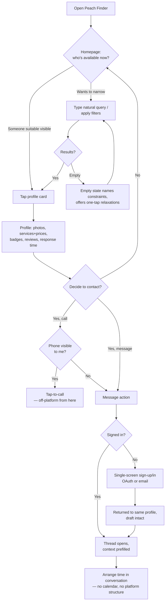
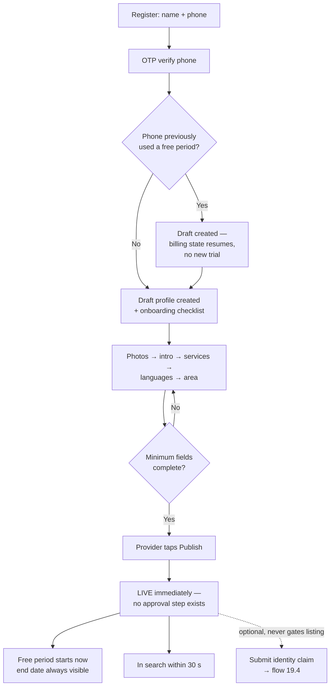
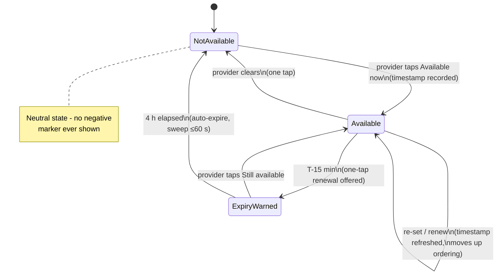
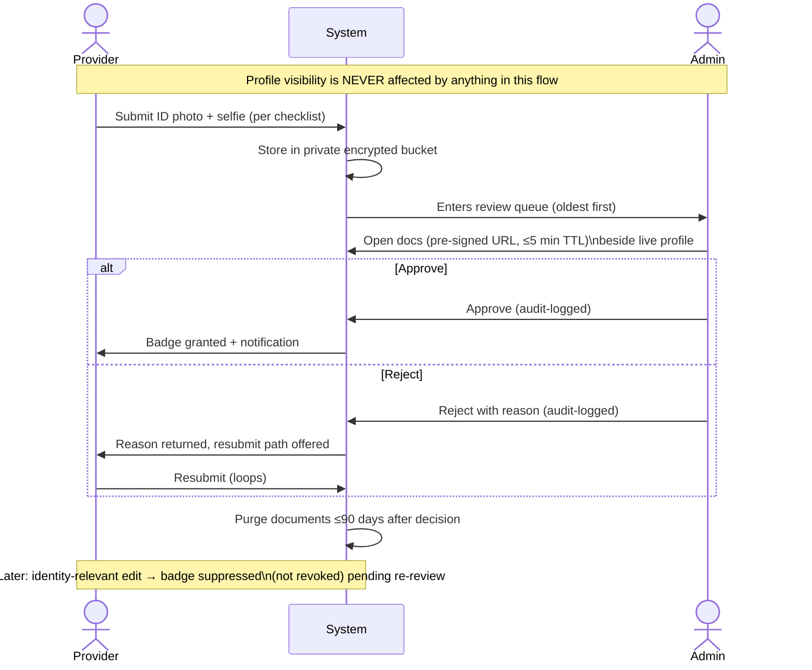
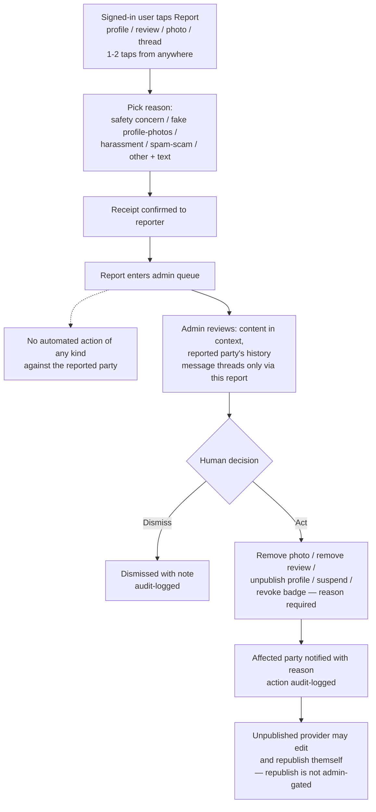
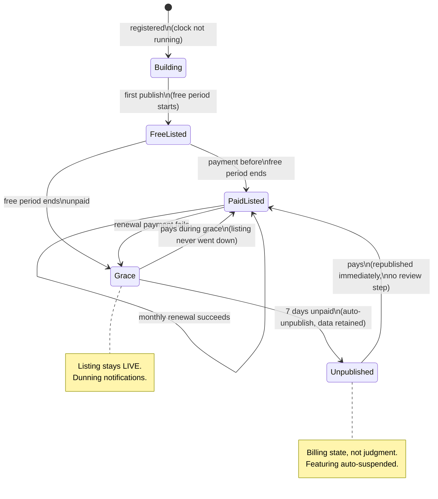
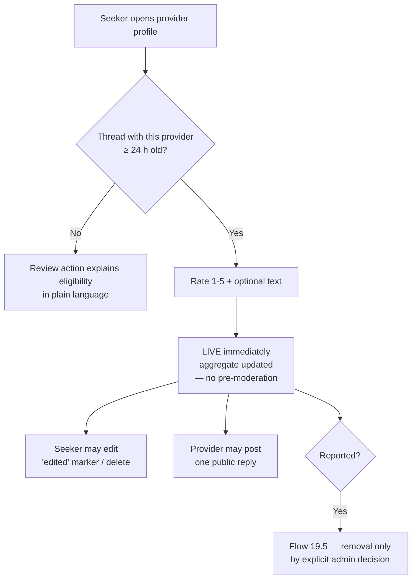

# Use Cases, User Stories & Process Flows

## 1. Document Control

| Field | Value |
|---|---|
| Product | Peach Finder |
| Document | Use Cases, User Stories & Process Flows |
| Owner | Kumbirai (kumbirai@gmail.com) |
| Upstream | `documentation/00-business-requirements/brd.md` (BRD), `documentation/01-functional-requirements-specification/frs.md` (FRS — signed-off baseline), `documentation/02-system-requirements-specification/srs.md` (SRS) |
| Downstream | `04-solution-architecture`, `05-low-level-design`, `06-ui-ux-design`, `07-test-artifacts` |
| Status | Living document — updated in place as decisions evolve; see repo history for change record |

**What this document is:** system behaviour from the user's point of view — the concrete targets the delivery team builds and tests against. Each epic opens with a use-case summary (actor, trigger, outcome), then breaks into user stories with testable acceptance criteria. §19 holds the end-to-end process flows the stories participate in. Every story traces to its driving FRs; §20 confirms full FRS coverage.

**Conventions:**
- **Story ID:** `US-<EPIC>-<NN>`. Priorities inherit MoSCoW from the FRS: **M** / **S** / **C** / **W**. A story's priority is the highest priority of the FRs it delivers.
- **Acceptance criteria** are written Given/When/Then where a scenario is the clearest form, and as verifiable statements where a rule is. Every criterion is testable — if it can't fail a test, it doesn't belong here.
- **Actors** are the FRS §2 five: *anonymous seeker*, *seeker* (signed in), *provider*, *admin*, *system*.
- **Definition of Ready** for any story entering a build iteration: acceptance criteria agreed, upstream FRs identified, UX state (screen/flow) identified in `06-ui-ux-design` once that exists.
- **Definition of Done** for every story, in addition to its own criteria: meets the FR-UX-02/SR-PERF budgets on the reference device (mid-range Android, 4G); WCAG 2.2 AA (FR-UX-03); error states follow the FR-UX-05 friendly pattern (what happened + what to do next, input preserved); works at 360 px viewport up through desktop (SR-COMPAT-01).

**Binding stances inherited from upstream (no story below may contradict them):**
1. **Moderation is human, with no system gating** (FRS §1). No story introduces pre-publication review, automated content analysis, or any system gate between a user's action and their content being live. The only admin-review workflow is identity-badge granting, and it gates the badge, never the profile.
2. **No booking calendar.** Time is arranged inside the message thread; the system never tracks whether a booking was made or kept.
3. **No service-fee payments.** The platform bills providers for listing/featuring only.
4. Report reasons are exactly the FR-TRUST-07 taxonomy: *safety concern, fake profile/photos, harassment, spam/scam, other (+ free text)*.

---

## 2. Personas (working set)

Grounded in BRD §5; named so stories and design work can refer to a person, not a role.

| Persona | Role | Sketch | What "great" feels like to them |
|---|---|---|---|
| **Thandi** | Seeker (mobile, anonymous-first) | 29, office worker, sore shoulders on a Friday evening, has never used the platform. Searches on her phone, won't create an account until something makes it worth it. | Opens the site, sees who's available *tonight* near her, picks someone trustworthy from the profile alone, and makes contact in under three minutes. |
| **Marcus** | Seeker (returning, signed in) | 41, gets a monthly sports massage, has two therapists he rotates between. | Jumps straight to his message threads, checks who's available now, books by chat in a couple of messages. |
| **Naledi** | Provider (established) | 35, independent massage therapist, seven years' practice, works from a studio at home. Busy — manages the platform from her phone between clients. | Sets "Available now" in one tap when a slot opens, replies fast, watches enquiries arrive. Analytics show her the platform pays for itself. |
| **Sipho** | Provider (new) | 27, newly qualified, building a client base from scratch. Price-sensitive — the free listing period is what got him to try. | Guided onboarding gets his profile live the same afternoon, free period clearly explained, first enquiry within days, identity badge soon after. |
| **Amara** | Platform admin | Internal team member. Works the identity queue and the reports queue daily; adjusts platform config occasionally. | Queues are fast to work, context is one glance away, every action she takes is recorded, and nothing happens on the platform that she didn't explicitly decide. |

---

## 3. Epic map

| Epic | Code | Primary actor | One-line outcome | FRS modules |
|---|---|---|---|---|
| E1 Discover who's available | DISC | Anonymous seeker / seeker | Find an available, suitable therapist fast | SRCH, AVAIL (read side) |
| E2 Judge a provider from their profile | VIEW | Anonymous seeker / seeker | Decide to make contact without a phone call | PROF (read side), TRUST (read side), REV (read side) |
| E3 Get an account without losing my place | ACC | Anonymous seeker → seeker | Sign up mid-flow and land back where I was | ACC, UX |
| E4 Contact & arrange by message | MSG | Seeker ↔ provider | Agree a time inside the conversation | MSG, NOTIF |
| E5 Reviews & ratings | REV | Seeker | Leave and rely on honest reviews | REV |
| E6 Stay safe: report & block | SAFE | Seeker ↔ provider | Escalate to a human, cut off contact instantly | TRUST, MSG |
| E7 Become a provider & build my profile | PONB | Provider | Go from nothing to a live, convincing profile | ACC, PROF, UX |
| E8 Run my availability | AVAIL | Provider | Keep the "available now" signal true with near-zero effort | AVAIL |
| E9 Earn the identity badge | VERIF | Provider + admin | Get verified without my listing ever being held hostage | TRUST, ADM |
| E10 Understand how I'm found | ANLY | Provider | See views, appearances, contacts, and demand trends | ANLY |
| E11 Pay to be listed & featured | BILL | Provider | Transparent free period, painless billing, fair featuring | MONET |
| E12 The right nudge at the right time | NOTIF | System → all users | Notifications that help and never spam | NOTIF |
| E13 Keep the platform honest (admin) | ADMIN | Admin | Human moderation, fast queues, full audit trail | ADM, TRUST |
| E14 My data, my contact details | PRIV | All users | Privacy defaults that protect without being asked | PRIV, PROF, ACC |

---

## 4. E1 — Discover who's available (DISC)

**Use case:** an anonymous seeker (Thandi) opens Peach Finder wanting a massage soon. Trigger: need + free moment, almost always on a phone. Outcome: a shortlist of available, credible therapists near her, reached in seconds, with zero account friction. This epic is the product's principal proposition — if E1 is slow or stale, nothing else matters.

- **US-DISC-01 (M) — The homepage answers "who is available now?"**
  As an anonymous seeker, I want the homepage to immediately show therapists who are available right now, most recently indicated first, so that I don't have to dig for the one thing I came for.
  **Acceptance criteria:**
  - Given published providers hold "Available now", when anyone loads the homepage, then those providers appear first, ordered by most-recently-set/renewed availability timestamp.
  - Remaining published providers **always** appear below the available cohort (not only when nobody is available), ordered by "Active this week" recency — the page is never empty and never apologises.
  - Availability shown is never staler than 60 s (SR-PERF-06); each available card carries recency phrasing ("Available now — updated 12 min ago").
  - Homepage is interactive ≤ 3 s on the reference device (FR-UX-02) and renders meaningful content server-side (FR-UX-08).
  **Traces:** FR-SRCH-01, FR-AVAIL-05, FR-UX-02, FR-UX-08.

- **US-DISC-02 (M) — Search the way I'd say it**
  As a seeker, I want to type what I want in plain words ("deep tissue near me", "massage therapist available tonight") and get correctly filtered results, so that I don't have to learn the platform's filter UI first.
  **Acceptance criteria:**
  - The sticky search bar accepts free text; the system translates it into structured filters covering at minimum: availability, service/technique, rating, language, verification, and proximity intents.
  - Every BRD §13 example query resolves to a sensibly filtered result set (this is the acceptance set).
  - Given the same query, filters, and location, any two users get identical results (FR-SRCH-13 — no personalization).
  - The derived filters are displayed as removable chips identical to manual filters, so I can see and correct the interpretation (FR-SRCH-05).
  **Traces:** FR-SRCH-02, FR-SRCH-05, FR-SRCH-13, SR-APP-02.

- **US-DISC-03 (M) — Suggestions as I type**
  As a seeker, I want instant suggestions while typing, so that search feels fast and I discover what I can ask for.
  **Acceptance criteria:**
  - Suggestions render ≤ 200 ms after keystroke (server ≤ 100 ms, SR-PERF-02), covering service terms, areas, and recognized intents.
  - Given an anonymous user types a person's name, then suggestions never surface individual provider names — discovery is by service, not people-lookup (FR-SRCH-07).
  **Traces:** FR-SRCH-07, SR-PERF-02.

- **US-DISC-04 (M) — Filter and refine without losing my place**
  As a seeker, I want manual filters for price, language, minimum rating, and verified status that combine with my search, so that I can narrow to exactly what I need.
  **Acceptance criteria:**
  - Filters combine with each other and with a natural-language query; applying one updates results ≤ 1 s without a full page reload.
  - Active filters are always visible and individually removable.
  - Rating filter uses minimum average rating; providers with no reviews show "New", never a zero score (FR-REV-05).
  **Traces:** FR-SRCH-04, FR-REV-05, SR-PERF-03.

- **US-DISC-05 (M) — "Near me" without giving up my privacy**
  As a seeker, I want proximity search using my device location (or a typed area if I decline), so that results are actually reachable.
  **Acceptance criteria:**
  - "Near me" triggers the browser permission prompt; on denial, a manual area entry is offered inline — proximity still works, degraded gracefully.
  - Distance is computed and displayed to the provider's stated *area*, never an exact address.
  - My device coordinates are used for the request only and never stored server-side (FR-PRIV-02).
  **Traces:** FR-SRCH-06, FR-PROF-04, FR-PRIV-02, SR-INT-06.

- **US-DISC-06 (M) — Availability outranks everything, honestly**
  As a seeker, I want available therapists ranked first in any result set, and paid placement clearly labelled, so that ordering reflects my interest, not just the platform's revenue.
  **Acceptance criteria:**
  - In any result set, providers holding "Available now" rank above those who don't, ordered by availability recency; the rest follow by query relevance.
  - Featured results still genuinely match my query and filters; every featured card carries an always-visible "Featured" label.
  - Given an availability-ordered view, a featured-but-unavailable provider never appears above a non-featured available one.
  - Only published, currently-listed providers (free period or paid) ever appear in results or on the homepage.
  **Traces:** FR-SRCH-03, FR-SRCH-08, FR-SRCH-09.

- **US-DISC-07 (M) — Empty results that help instead of a dead end**
  As a seeker whose filters matched nobody, I want to see which constraint did it and loosen it in one tap, so that a miss becomes a near-hit.
  **Acceptance criteria:**
  - Given zero results, the empty state names the constraining filters and offers one-tap relaxations (e.g., "remove 'available now'", "widen area"), each of which re-runs the search.
  - The empty state's tone follows FR-UX-05 (plain language, next step offered).
  **Traces:** FR-SRCH-10, FR-UX-05.

- **US-DISC-08 (S) — Cards I can shortlist from**
  As a seeker scanning results, I want large photo-forward cards with the facts that matter, so that I can shortlist without opening every profile.
  **Acceptance criteria:**
  - Each card shows: primary photo, name, intro extract, availability state + recency, badges, rating + review count, starting price, languages, distance to area, and a primary contact action.
  - Cards are thumb-friendly at 360 px viewport; text over photography stays legible (FR-UX-04).
  **Traces:** FR-SRCH-11, FR-UX-01, FR-UX-04.

- **US-DISC-09 (C) — Re-run my recent searches**
  As a returning seeker, I want my recent searches remembered on this device for one-tap re-run.
  **Acceptance criteria:** recent searches stored per device (first-party storage only, SR-PRIV-04); one tap re-runs query + filters; clearable.
  **Traces:** FR-SRCH-12.

---

## 5. E2 — Judge a provider from their profile (VIEW)

**Use case:** Thandi taps a card. The profile must function as a mini landing page (BR-7): rich enough that she decides to make contact — or not — without a prior phone call. Trigger: card tap from any discovery surface or a shared link. Outcome: a confident contact action, or a confident back-swipe.

- **US-VIEW-01 (M) — Everything I need to decide, on one screen**
  As a seeker, I want the full profile — photos, intro, services with prices, tags, languages, reviews, response time, online status, and contact actions — so that the profile replaces the "so, tell me about yourself" phone call.
  **Acceptance criteria:**
  - Profile renders the complete FR-PROF-01 field set; gallery supports 1–12 photos with the primary first.
  - Trust badges sit directly under the provider name; rating average + count near the top — trust signals are above the fold at 360 px (FR-PROF-10).
  - Services are listed with name, optional description, duration, and price.
  - Profile is viewable without an account, loads ≤ 2.5 s on subsequent navigations, and renders server-side with correct link-preview metadata.
  **Traces:** FR-PROF-01, FR-PROF-10, FR-ACC-01, FR-UX-02, FR-UX-08.

- **US-VIEW-02 (M) — Honest presence, not surveillance**
  As a seeker, I want to see whether the provider is online or roughly when they were last active, so that I can gauge whether to expect a quick reply — without anyone being trackable.
  **Acceptance criteria:**
  - Online status shows "online" (recent heartbeat) or coarse buckets only: "today", "this week", "a while ago". Exact last-seen timestamps are never exposed by UI or API (server-side coarsening, SR-APP-06).
  - Response time appears in honest buckets ("usually replies within 30 minutes / within a few hours / within a day"); providers with too little data show no claim rather than a fabricated one.
  **Traces:** FR-PROF-06, FR-MSG-08, SR-APP-06.

- **US-VIEW-03 (M) — Contact actions where my thumb is**
  As a seeker who's decided, I want Message (and Call, when the provider allows it) as prominent sticky actions, so that deciding and acting are the same moment.
  **Acceptance criteria:**
  - Message is the primary action, sticky on the profile screen at mobile sizes; tapping it as an anonymous user routes through the US-ACC-02 continuity flow.
  - Call appears with a tap-to-call number if (provider has phone visibility ON) or (I am a signed-in seeker); otherwise no number appears anywhere in the served markup (server-side hiding, FR-PRIV-01).
  **Traces:** FR-PROF-07, FR-PROF-08, FR-PRIV-01, FR-UX-01.

- **US-VIEW-04 (M) — Badges that explain themselves**
  As a seeker, I want each badge to tell me exactly what it does and doesn't mean, so that trust is informed, not implied.
  **Acceptance criteria:**
  - Exactly two badges exist anywhere in the product: "Identity verified" and "Active this week" (FR-TRUST-01).
  - Tapping/hovering a badge reveals a one-line plain-language explanation; the badge area links to the safety-information page (S).
  **Traces:** FR-TRUST-01, FR-TRUST-09.

- **US-VIEW-05 (M) — Reviews I can weigh**
  As a seeker, I want the review list with ratings, text, coarse dates, and reviewer first name + initial, so that I can judge the pattern, not just the average.
  **Acceptance criteria:**
  - Profile shows average, count, and reviews newest-first; each shows rating, text, "Thandi M.", and month/year only (never exact dates).
  - Edited reviews carry an "edited" marker; provider replies (where present) appear beneath the review.
  **Traces:** FR-REV-03, FR-REV-04, FR-REV-06.

- **US-VIEW-06 (S) — Share a profile**
  As a seeker, I want to share a profile link (to a friend, or to my other device), so that shortlisting can happen socially.
  **Acceptance criteria:** copy-link and OS share sheet available; shared links open the public profile with correct preview card (title, primary photo).
  **Traces:** FR-PROF-11, SR-APP-01.

---

## 6. E3 — Get an account without losing my place (ACC)

**Use case:** account creation is deliberately *not* a front door — it's a turnstile that appears only when an action needs identity (message, review, report, block), and it must hand the user back exactly where they were. Trigger: an anonymous user attempts an account-gated action, or chooses to sign up/in directly. Outcome: a signed-in seeker mid-flow, original context intact.

- **US-ACC-01 (M) — Browse everything without an account**
  As an anonymous seeker, I want to browse the homepage, search, filter, and read full profiles without ever being asked to sign in, so that the platform proves its value before asking for anything.
  **Acceptance criteria:**
  - No discovery or profile-viewing surface presents a login wall, modal nag, or content truncation for anonymous users.
  - Account-gated actions (message, review, report, block) are visible but route to sign-in on tap — never hidden.
  **Traces:** FR-ACC-01, FR-ACC-05.

- **US-ACC-02 (M) — Sign up mid-action and land back in it**
  As an anonymous seeker who tapped Message, I want a single-screen sign-up (one-tap OAuth or email+password) that returns me to the exact thing I was doing, so that the interruption costs me seconds, not my intent.
  **Acceptance criteria:**
  - Given I tap an account-gated action, when I complete sign-up or sign-in, then I am returned to the same profile/thread with my context intact — including a message draft I had started composing.
  - The interruption is one screen; Google OAuth is available at launch (Apple S); email+password always remains available.
  - Given I registered by email, I must verify my email before my first message sends; the pending message is held and sent on verification, not lost.
  **Traces:** FR-ACC-02, FR-ACC-05, FR-UX-06, SR-INT-04.

- **US-ACC-03 (M) — Stay signed in, sign out anywhere**
  As a seeker on my own phone, I want to stay signed in across visits, and to be able to sign out explicitly, so that return visits are instant but shared devices stay safe.
  **Acceptance criteria:**
  - Sessions persist by default ("keep me signed in", 90-day rolling); explicit sign-out is available on every authenticated surface and revokes the session immediately.
  - Password reset works via single-use emailed link (≤ 1 h expiry); email/phone/password changes require re-authentication and revoke other sessions (SR-SEC-04).
  **Traces:** FR-ACC-06, FR-ACC-09, SR-SEC-04.

- **US-ACC-04 (S) — One person, both roles**
  As a therapist who also books massages, I want both roles under one login with an explicit switch, so that I don't juggle two accounts.
  **Acceptance criteria:** role switch is explicit and visible; messages, reviews, and analytics for the two roles never co-mingle in the UI.
  **Traces:** FR-ACC-08.

- **US-ACC-05 (M) — Delete my account**
  As any user, I want to delete my account and understand what happens to my traces, so that leaving is a right, not a negotiation.
  **Acceptance criteria:**
  - Deletion is self-serve with a confirmation step (FR-UX-05); provider deletion unpublishes the profile immediately.
  - My message threads remain for the other party labelled "Deleted account"; my reviews remain attributed to "Former user".
  - Personal data is deleted/irreversibly anonymized ≤ 30 days; what survives (billing/tax, moderation records) is stated in plain language at the point of deletion.
  **Traces:** FR-ACC-07, FR-PRIV-03, SR-DATA-04.

---

## 7. E4 — Contact & arrange by message (MSG)

**Use case:** messaging is where booking happens — Marcus and Naledi agree a time inside the thread; the platform supplies speed and safety, never structure. Trigger: seeker taps Message on a profile, or either party returns to a thread. Outcome: a time agreed in conversation; the platform doesn't know and doesn't need to.

- **US-MSG-01 (M) — Start the conversation from the profile**
  As a signed-in seeker, I want to message any published provider straight from their profile, so that contact is one tap from decision.
  **Acceptance criteria:**
  - One persistent thread per seeker–provider pair; re-tapping Message reopens it with history.
  - Given the thread started from a specific service, the composer prefills context ("Re: 60 min deep tissue") as editable text (S).
  - Given either party has blocked the other, the Message action is absent/disabled and no new thread can be created.
  **Traces:** FR-MSG-01, FR-MSG-04, FR-TRUST-08.

- **US-MSG-02 (M) — A conversation that keeps up**
  As either party, I want messages to arrive without refreshing, with sent/delivered/read states, so that arranging a time feels like texting, not email.
  **Acceptance criteria:**
  - Messages appear to an online counterpart ≤ 2 s p95 over a persistent channel; polling fallback degrades latency, never functionality (SR-APP-05, SR-COMPAT-03).
  - Sent/delivered/read states are visible and update live; photo attachments supported (S).
  **Traces:** FR-MSG-02, SR-APP-05, SR-PERF-04.

- **US-MSG-03 (M) — Arrange the time in words, not widgets**
  As a seeker, I want light quick-start prompts ("Are you available today at …?") that insert editable text, so that proposing a time is easy — while the platform stays out of the arrangement.
  **Acceptance criteria:**
  - Quick-start prompts insert plain editable text only — no slot pickers, booking states, confirmations, or conflict checks exist anywhere in the thread.
  - The system stores no structured booking data and never reports whether a booking occurred.
  **Traces:** FR-MSG-03, FR-MSG-04, FR-AVAIL-08 (guard).

- **US-MSG-04 (M) — My inbox, at a glance**
  As a provider juggling clients (Naledi), I want threads ordered by latest activity with unread indicators surfaced in the app chrome, so that no enquiry silently goes cold.
  **Acceptance criteria:**
  - Thread list ordered by latest activity; unread state per thread; unread count in app chrome for both roles.
  - New-message notifications follow E12 rules (delay-if-unread email, batching, block silence).
  **Traces:** FR-MSG-06, FR-MSG-07, FR-NOTIF-01/03.

- **US-MSG-05 (M) — I know I'm on the clock (provider)**
  As a provider, I want to be told — at onboarding and in the thread UI — that first-reply speed to new enquiries is measured and displayed on my profile, so that the response-time metric is never a surprise.
  **Acceptance criteria:**
  - Onboarding and thread UI both state the measurement plainly.
  - Only first replies to *new* inbound threads count, over a trailing 30-day window (admin-configurable); ongoing chatter is excluded.
  **Traces:** FR-MSG-07, FR-MSG-08.

- **US-MSG-06 (M) — Safety is two taps away, mid-conversation**
  As either party, I want report and block reachable from the thread header in at most two taps, so that a conversation going wrong can be escalated or ended instantly. (Full behaviour in E6.)
  **Traces:** FR-MSG-05, FR-TRUST-07, FR-TRUST-08.

---

## 8. E5 — Reviews & ratings (REV)

**Use case:** with no bookings or payments, a prior conversation is the platform's engagement proxy. Trigger: a seeker who has an established thread wants to record their experience. Outcome: an immediately-live review that other seekers can weigh, filter by, and that a human — only a human — can ever remove.

- **US-REV-01 (M) — Leave a review that counts**
  As a seeker, I want to rate (1–5 stars) and optionally describe my experience with a provider I've actually engaged with, so that my experience helps the next person.
  **Acceptance criteria:**
  - Eligibility: I have a message thread with this provider at least 24 hours old. One review per seeker per provider.
  - Given I'm not yet eligible, the review action explains why in plain language ("You can review after you've been in contact for a day") rather than hiding.
  - Review text is length-capped; rating is mandatory, text optional.
  **Traces:** FR-REV-01.

- **US-REV-02 (M) — Live immediately, human-removable only**
  As a reviewer, I want my review live the moment I submit, so that feedback is never held in a queue.
  **Acceptance criteria:**
  - Submission publishes immediately — no pre-moderation, no automated screening of any kind.
  - The review updates the provider's average and count atomically; removal is exclusively an explicit admin action (on report or admin initiative).
  **Traces:** FR-REV-02, FR-REV-07, FR-ADM-05.

- **US-REV-03 (M) — Change my mind**
  As a reviewer, I want to edit or delete my own review, so that it can stay accurate.
  **Acceptance criteria:** edit updates the aggregate and shows an "edited" marker; delete removes it from the aggregate; both require confirmation per FR-UX-05.
  **Traces:** FR-REV-04.

- **US-REV-04 (M) — Ratings I can search by, fairly**
  As a seeker, I want to filter by minimum rating and search "highly rated", with new providers shown as "New" rather than punished with a zero, so that ratings inform without distorting.
  **Acceptance criteria:**
  - "Highly rated" query intent maps to the configured threshold (default ≥ 4.5 average with ≥ 3 reviews).
  - No-review providers display "New" on cards and profiles and are excluded from minimum-rating filters, not ranked as zero.
  **Traces:** FR-REV-05, FR-SRCH-02.

- **US-REV-05 (S) — The provider's right of reply**
  As a provider, I want to post one public reply per review, so that my side of a story is visible where the story is told.
  **Acceptance criteria:** one reply per review, shown beneath it; reply is reportable and human-removable via the same path as reviews.
  **Traces:** FR-REV-06.

- **US-REV-06 (M) — Blocking doesn't rewrite history**
  As either party, blocking prevents new contact but leaves existing reviews standing in both directions, so that blocking can't be used to scrub feedback.
  **Traces:** FR-REV-07, FR-TRUST-08.

---

## 9. E6 — Stay safe: report & block (SAFE)

**Use case:** an in-person-services platform must make escalation effortless and consequences human. Trigger: anything from an uneasy feeling to harassment, on either side. Outcome: a block that takes effect instantly and silently, and/or a report that a human admin will resolve — with **no automated consequence of any kind** for the reported party.

- **US-SAFE-01 (M) — Report anything, from anywhere, in two taps**
  As a signed-in user, I want to report a profile, review, photo, or message thread from wherever I'm looking at it, so that escalation never requires hunting.
  **Acceptance criteria:**
  - Report is reachable from every profile and every conversation in one–two taps.
  - The flow offers exactly the reason taxonomy: *safety concern, fake profile/photos, harassment, spam/scam, other* (+ free text), and confirms receipt in-app.
  - Filing a report triggers **no automated action** against the reported party — consequences are exclusively human decisions (E13).
  **Traces:** FR-TRUST-07, FR-MSG-05, FR-NOTIF-01.

- **US-SAFE-02 (M) — Block: instant, silent, messages both ways**
  As a seeker or provider, I want blocking to cut off contact immediately in both directions without notifying the other party, so that ending contact doesn't create a confrontation.
  **Acceptance criteria:**
  - Blocking prevents new messages both ways instantly.
  - Discovery hide is **asymmetric per FR-TRUST-08**: the blocker is hidden from the blocked party's future search/browse results; the blocked party is not hidden from the blocker's search.
  - The blocked party receives no notification of the block, and their activity never generates notifications for the blocker.
  - I can view and undo my own blocks in settings.
  **Traces:** FR-TRUST-08, FR-NOTIF-03.

- **US-SAFE-03 (S) — Know what the badges actually mean**
  As a seeker, I want a concise safety page — what badges do and don't verify, incall meeting-safety basics, how to report — linked from every profile's badge area and the footer, so that trust is calibrated, not assumed.
  **Traces:** FR-TRUST-09.

---

## 10. E7 — Become a provider & build my profile (PONB)

**Use case:** Sipho goes from nothing to a live, convincing profile in one guided sitting, on his phone. Trigger: decision to list. Outcome: a published profile he controls absolutely — live the instant *he* publishes it, editable live thereafter, never gated by anyone.

- **US-PONB-01 (M) — Register as a provider**
  As a prospective provider, I want to register with my name, OTP-verified mobile number, and general service area, so that I have a draft profile to build on.
  **Acceptance criteria:**
  - Registration captures display name, mobile number (verified via 6-digit OTP per SR-INT-02 limits), and general service location (area granularity).
  - Completing registration creates a draft profile and drops me into the onboarding checklist.
  - OTP failures/resends follow SR-INT-02 limits with friendly errors; the form never loses my input.
  **Traces:** FR-ACC-03, SR-INT-02, FR-UX-05.

- **US-PONB-02 (S) — Guided onboarding that converts**
  As a new provider, I want a resumable checklist — photos → intro → services → languages → location → publish — with per-step guidance, so that I build a profile that actually gets contacts.
  **Acceptance criteria:**
  - Checklist shows progress, is resumable across sessions, and offers per-step conversion guidance (photo quality tips, intro examples).
  - Publish-readiness is a visible checklist driven by the minimum field set.
  **Traces:** FR-UX-07, FR-PROF-02.

- **US-PONB-03 (M) — Build the profile itself**
  As a provider, I want to add 1–12 photos, a short intro, services with duration and price, curated service tags, and languages, so that my profile sells me.
  **Acceptance criteria:**
  - Gallery: 1–12 photos, first is primary, reorderable; uploads validated technically only (type/size ≤ 10 MB/decodability) — **never content-reviewed**; EXIF/GPS stripped on upload (invisible to me, verified in tests).
  - Intro capped ~600 chars with live count; services structured (name, optional description, duration, price); tags selected from the curated vocabulary — I can propose a missing tag, and my profile is never blocked on the outcome.
  - Location is area/suburb granularity only; the UI never asks for a street address.
  **Traces:** FR-PROF-01, FR-PROF-03, FR-PROF-04, SR-MEDIA-02/03.

- **US-PONB-04 (M) — I publish it. Nobody else.**
  As a provider, I want my profile live the moment I hit Publish (minimum fields complete), so that going live is my decision alone.
  **Acceptance criteria:**
  - Given minimum fields are complete (≥ 1 photo, intro, ≥ 1 priced service, ≥ 1 language, area), when I tap Publish, then the profile is publicly live immediately — no approval step, review queue, or automated content check stands between Publish and live.
  - Publishing starts my free listing period (E11) and is reflected in search within ≤ 30 s.
  **Traces:** FR-ACC-04, FR-PROF-02, FR-MONET-02, SR-APP-03.

- **US-PONB-05 (M) — Edit live, always**
  As a provider, I want every edit — including photo changes — live on save, so that my profile is always current.
  **Acceptance criteria:**
  - Edits are live immediately; no edit triggers review, re-approval, or temporary unpublishing.
  - Sole exception, badges only: identity-relevant changes (name, verified phone) suppress the identity badge pending re-review with a plain-language explanation — profile visibility untouched (E9).
  **Traces:** FR-PROF-05, FR-TRUST-04.

- **US-PONB-06 (M) — Unpublish and come back freely**
  As a provider, I want to hide my profile any time and republish later with no data loss and no re-approval, so that a holiday isn't an exit.
  **Traces:** FR-PROF-09.

- **US-PONB-07 (M) — Control my phone number's exposure**
  As a provider, I want a clearly-explained setting for whether visitors *without* accounts see my number (default OFF), so that I choose my own reachability/privacy trade-off.
  **Acceptance criteria:**
  - Setting label and effect explained in plain language where it's set; default OFF.
  - ON: tap-to-call number visible to everyone. OFF: number absent from anonymous page markup entirely (server-side); signed-in seekers see it either way.
  **Traces:** FR-PROF-08, FR-PRIV-01.

- **US-PONB-08 (S) — See myself as seekers see me**
  As a provider, I want a "preview as seeker" mode showing the anonymous view and the signed-in view, so that I know exactly what each audience sees (they differ by phone visibility).
  **Traces:** FR-PROF-12.

---

## 11. E8 — Run my availability (AVAIL)

**Use case:** the "Available now" signal is the product. Naledi's client cancels; she has a free 90 minutes — one tap and she's at the top of the homepage. The system's job is keeping that signal *true*: trivially easy to set, impossible to forget on.

- **US-AVAIL-01 (M) — One tap: I'm available**
  As a provider, I want to set "Available now" with a single tap from my dashboard or profile, so that a freed-up slot becomes visibility in seconds.
  **Acceptance criteria:**
  - Single-tap set from dashboard and from a persistent control on my own profile view, reachable within one screen of opening the app signed-in.
  - Timestamp recorded on every set/re-set; discovery surfaces reflect it ≤ 30 s; re-setting refreshes the timestamp and moves me up the recency ordering.
  **Traces:** FR-AVAIL-01, FR-AVAIL-04, SR-APP-03/04.

- **US-AVAIL-02 (M) — One tap: I'm done**
  As a provider, I want to clear my status just as fast, so that keeping the signal honest costs nothing.
  **Traces:** FR-AVAIL-02.

- **US-AVAIL-03 (M) — The signal can't go stale**
  As a seeker (beneficiary), I want "Available now" to auto-expire (default 4 h) with the provider warned ~15 min ahead and offered one-tap renewal, so that I'm never chasing yesterday's availability.
  **Acceptance criteria:**
  - Status auto-expires after the configured duration; expiry enforced within 60 s of the deadline (SR-APP-04).
  - Provider gets a pre-expiry notification with one-tap "Still available" that refreshes the timestamp.
  - Expired status simply disappears — no negative marker; absence of availability is neutral, never a demerit.
  **Traces:** FR-AVAIL-03, FR-AVAIL-05, SR-APP-04/10.

- **US-AVAIL-04 (M) — "Active this week", earned automatically**
  As a provider, I want the "Active this week" badge computed from my actual activity (sign-in, availability, edits, messages in trailing 7 days) with no human involved, so that staying visible just means staying active.
  **Acceptance criteria:**
  - Badge appears/disappears purely by computation, evaluated at least daily; no admin can grant or edit it.
  **Traces:** FR-AVAIL-06, FR-TRUST-06.

- **US-AVAIL-05 (S) — No black boxes about my own signals**
  As a provider, I want my dashboard to show exactly why I do/don't hold "Active this week" and when my "Available now" expires, so that the signals describing me are never a mystery to me.
  **Traces:** FR-AVAIL-07.

*(Guard: no story anywhere adds schedules, future slots, or "available from 18:00" — availability is strictly present-tense. FR-AVAIL-08.)*

---

## 12. E9 — Earn the identity badge (VERIF)

**Use case:** Sipho submits ID + selfie; Amara reviews; the badge appears only after her approval. The listing itself is never touched — pending, rejected, or never-submitted, the profile's visibility is identical. Trigger: provider chooses to verify. Outcome: a badge that means "a human checked", granted without ever holding the profile hostage.

- **US-VERIF-01 (M) — Submit my identity claim**
  As a provider, I want to submit a government-ID photo and selfie from my dashboard against a published checklist, so that I can earn the "Identity verified" badge.
  **Acceptance criteria:**
  - Submission enters the admin queue; I see status (pending/approved/rejected) on my dashboard.
  - My documents are stored privately (encrypted bucket, admin-only, never displayed in-product) and purged ≤ 90 days after decision.
  - My profile's visibility is completely unaffected at every stage.
  **Traces:** FR-TRUST-02, FR-TRUST-03, FR-PRIV-05, SR-MEDIA-01.

- **US-VERIF-02 (M) — A human decides; the badge follows**
  As a provider, I want the badge to appear only after admin approval, and a rejection to come with a reason and a resubmit path, so that the badge means something and rejection is recoverable.
  **Acceptance criteria:**
  - An unreviewed or pending submission never renders the badge (hard requirement, BRD §8 NFR).
  - Approval grants the badge and notifies me; rejection returns a reason and I may resubmit.
  **Traces:** FR-TRUST-02, FR-ADM-02, FR-NOTIF-01.

- **US-VERIF-03 (M) — Badge suppression on identity-relevant changes**
  As a verified provider who changes my display name or verified phone, I want the badge suppressed (not revoked) pending a lightweight re-review, with a clear explanation of why and what to do, so that the badge stays truthful without punishing me.
  **Acceptance criteria:** badge hidden, not revoked; profile visibility untouched; plain-language explanation with the re-review path.
  **Traces:** FR-TRUST-04.

*(Admin-side review is US-ADMIN-02; revocation is US-ADMIN-05.)*

---

## 13. E10 — Understand how I'm found (ANLY)

**Use case:** Naledi checks her dashboard monthly (a BRD success metric) to confirm the platform earns its fee. Trigger: curiosity or a renewal decision. Outcome: the four honest numbers, defined in-product, that connect her actions to her enquiries — with seekers never identifiable.

- **US-ANLY-01 (M) — My four numbers**
  As a provider, I want profile views, search appearances, contact requests, and most-searched services — each with a current total, a trend, and a prior-period comparison over 7/30/90-day ranges — so that I can see whether listing is working.
  **Acceptance criteria:**
  - Exactly the BR-17 metric set; default range 30 days; metric definitions displayed in-product (view = deduped per viewer per day; appearance = card rendered in a viewed result set; contact = new thread + tap-to-call taps where enabled).
  **Traces:** FR-ANLY-01, FR-ANLY-02.

- **US-ANLY-02 (M) — Aggregate always, identifiable never**
  As a seeker (protected party), analytics must never let a provider see who viewed or searched; counts below the floor display as "< 5".
  **Traces:** FR-ANLY-03, FR-PRIV-06, SR-APP-08.

- **US-ANLY-03 (M) — Demand signal I can act on**
  As a provider, I want the platform-wide most-searched service tags with my own offered tags highlighted, so that I can spot demand I'm not serving ("sports massage is trending; you don't offer it").
  **Traces:** FR-ANLY-04.

- **US-ANLY-04 (S) — Cause and effect on the chart**
  As a provider, I want my trend charts annotated with my own events (went available 5× this week; featured since the 12th), so that I can connect what I did to what happened.
  **Traces:** FR-ANLY-05.

---

## 14. E11 — Pay to be listed & featured (BILL)

**Use case:** the deal is transparent: publish free for the configured period, then a monthly listing fee to stay discoverable; featuring is an optional add-on. Trigger: first publish starts the clock. Outcome: providers always know where they stand; lapse is billing state (never judgment) and is instantly reversible by paying.

- **US-BILL-01 (M) — A free period I can trust**
  As a new provider, I want my free period to start when I first *publish* (not register) and to always see when it ends and what happens then, so that the clock never runs while I'm still building and the cliff is never a surprise.
  **Acceptance criteria:**
  - Free period starts at first publish; length is platform-configured.
  - Dashboard always shows free-period end date and what follows; "trial ending soon" notification fires per E12.
  **Traces:** FR-MONET-01, FR-MONET-02, FR-ADM-06.

- **US-BILL-02 (M) — One free period per person, enforced quietly**
  As the platform, one free period is granted per OTP-verified phone number; re-registering with a previously-used number resumes prior billing state rather than granting a new trial.
  **Acceptance criteria:** re-registration with a used number gets listing continuity, not a fresh trial; messaging explains the state plainly without accusing.
  **Traces:** FR-MONET-03.

- **US-BILL-03 (M) — Painless self-serve billing**
  As a provider, I want to add/update a payment method, see the price before I buy, cancel renewal (staying live to period end), and get itemized receipts, so that billing never needs a support email.
  **Acceptance criteria:**
  - Card capture is hosted/tokenized by the PSP — card data never touches Peach Finder (SAQ-A); price shown pre-purchase; billing history with itemized receipts.
  - Cancel renewal keeps the listing live until the paid period ends.
  **Traces:** FR-MONET-06, SR-INT-03, SR-PRIV-03.

- **US-BILL-04 (M) — Lapse with grace, return instantly**
  As a provider whose payment failed or free period ended, I want a 7-day grace period with clear dunning, then auto-unpublish with everything retained, and instant republish the moment I pay, so that a billing hiccup never destroys my presence.
  **Acceptance criteria:**
  - Grace default 7 days, listing stays live, dunning notifications sent; at grace end unpaid → auto-unpublished, all data retained.
  - Paying at any point republishes immediately with no review step; webhook retries never double-charge or double-transition state (idempotent, SR-APP-12).
  - All lapse messaging is framed as billing state, never as moderation.
  **Traces:** FR-MONET-04, SR-APP-12, FR-NOTIF-01.

- **US-BILL-05 (M) — Buy fair featuring**
  As a paying provider, I want to add featuring as a recurring add-on that boosts my placement within the E1 fairness rules, so that I can buy visibility without the platform selling seekers a lie.
  **Acceptance criteria:**
  - Featuring requires an active listing; a lapsed listing suspends featuring automatically (nothing hidden can be featured).
  - Ranking effect and "Featured" labelling behave exactly per US-DISC-06.
  **Traces:** FR-MONET-05, FR-SRCH-08.

*(Guards: no seeker-to-provider payment flow of any kind exists — no checkout, deposits, tips, or "pay through us" affordances. FR-MONET-08. Pricing amounts are console configuration, FR-MONET-07.)*

---

## 15. E12 — The right nudge at the right time (NOTIF)

**Use case:** notifications exist to close loops — a message answered, an expiry renewed, a bill paid — and to be forgettable otherwise. Trigger: domain events. Outcome: users act on the thing itself (deep link), essential notices always arrive, and nobody is spammed.

- **US-NOTIF-01 (M) — The baseline event set**
  As the system, I dispatch: new message (push*/email if unread after a delay), identity review outcome (email + in-app), availability expiry warning (push*/in-app), billing events — trial ending, payment failed, grace warnings, unpublished (email + in-app), moderation outcomes affecting me (email + in-app, with reason), and report receipt (in-app). *Web push is the S-priority channel; email + in-app are the M baseline.*
  **Traces:** FR-NOTIF-01, SR-APP-07.

- **US-NOTIF-02 (M) — My channels, my choice — except what protects me**
  As a user, I want per-channel control of non-essential notifications, while billing, security, and moderation notices always deliver, so that I can silence noise without being able to silence consequences.
  **Traces:** FR-NOTIF-02.

- **US-NOTIF-03 (M) — Never a spam cannon**
  As a user, bursts collapse into one notification, and a blocked party's activity never generates a notification for me.
  **Traces:** FR-NOTIF-03.

- **US-NOTIF-04 (S) — Every notification lands me where I act**
  As a user, notification copy is plain-language and deep-links to the exact screen (the thread, the billing page, the resubmission form).
  **Traces:** FR-NOTIF-04.

---

## 16. E13 — Keep the platform honest (ADMIN)

**Use case:** Amara's console makes human review *fast* — it never automates judgment. Every report reaches a human resolution; every action she takes is reasoned and audit-logged; the platform's only content-takedown mechanisms are her explicit decisions. Trigger: queue items, lookups, config needs. Outcome: a trustworthy platform run by accountable humans.

- **US-ADMIN-01 (M) — A hardened console for a powerful job**
  As an admin, I want a dedicated, access-restricted console (TOTP 2FA mandatory, ≤ 12 h idle timeout) housing the identity queue, reports queue, account lookup, moderation actions, and platform config, so that admin power is usable and locked down.
  **Traces:** FR-ADM-01, SR-SEC-08.

- **US-ADMIN-02 (M) — Work the identity queue**
  As an admin, I want pending identity submissions oldest-first, each showing the documents beside the provider's live profile, with approve (badge granted) and reject-with-reason actions, so that turnaround is fast and informed.
  **Acceptance criteria:**
  - Documents open via short-lived pre-signed URLs (TTL ≤ 5 min) inside my authenticated session only.
  - Queue age is visible (turnaround is a stated operational dependency); decisions notify the provider and are audit-logged.
  **Traces:** FR-ADM-02, SR-MEDIA-01, FR-ADM-08.

- **US-ADMIN-03 (M) — Work the reports queue to human resolution**
  As an admin, I want each report with reporter, reported party, reason, the content in context (for message reports: the reported thread), and the reported party's history, resolved by my explicit dismiss-with-note or act decision, so that nothing auto-resolves and nothing festers.
  **Acceptance criteria:**
  - Every report reaches a recorded human resolution; nothing auto-resolves or auto-expires.
  - Message-content access exists *only* through a filed report's thread — the console has no general message-browsing capability.
  **Traces:** FR-ADM-03, FR-ADM-04, FR-MSG-09.

- **US-ADMIN-04 (M) — The only hands that take content down**
  As an admin, I want the explicit moderation actions — remove photo, remove review, unpublish profile (provider notified with reason; may edit and republish themself), suspend, reinstate, revoke identity badge — each demanding a recorded reason, so that takedown is always a reasoned human act.
  **Acceptance criteria:**
  - These actions are the only mechanisms in the product that remove content; each requires an explicit reason; each notifies the affected party per E12; each is audit-logged in the same transaction (SR-APP-12).
  - Admin unpublish is *not* a republish gate: the provider may edit and republish themself.
  **Traces:** FR-ADM-05, FR-TRUST-05, FR-ADM-08, SR-DATA-05.

- **US-ADMIN-05 (M) — Look up anyone, impersonate no one**
  As an admin, I want account lookup by name/email/phone showing profile, badge, billing/listing state, and report/moderation history — with no "log in as user" capability.
  **Traces:** FR-ADM-07.

- **US-ADMIN-06 (M) — Tune the platform without a deploy**
  As an admin, I want to edit: free-period length, availability expiry + reminder lead, "highly rated" threshold, response-time window, service-tag vocabulary, search lexicon, and pricing — effective ≤ 5 minutes, no deployment.
  **Traces:** FR-ADM-06, FR-MONET-07, SR-APP-11.

- **US-ADMIN-07 (M) — Everything I do is on the record**
  As the platform owner, every admin action (approvals, rejections, removals, suspensions, config changes) writes who/what/whom/when/reason to an append-only audit log no application path can edit or delete.
  **Traces:** FR-ADM-08, SR-DATA-05.

- **US-ADMIN-08 (S) — See the scaling wall coming**
  As an admin, I want an ops dashboard — identity-queue depth/age, reports-queue depth/age, new registrations, active listings — so that the manual-review scaling risk (BRD risk #2) is visible before it lands.
  **Traces:** FR-ADM-09, SR-OBS-07.

---

## 17. E14 — My data, my contact details (PRIV)

**Use case:** privacy here is mostly *defaults doing the right thing unasked* — enforced server-side, so nothing sensitive ever depends on the client behaving.

- **US-PRIV-01 (M) — My number leaks nowhere I didn't allow**
  As a provider, my phone number appears to anonymous visitors only when I've switched visibility ON — and when OFF it is absent from the served markup, not hidden by CSS.
  **Traces:** FR-PRIV-01, FR-PROF-08, SR-SEC-09.

- **US-PRIV-02 (M) — My address isn't in the system at all**
  As a provider, the platform collects and shows only my area — it has no field for my street address anywhere; precise directions are mine to share in messages when I choose. Photos I upload have EXIF/GPS stripped so my studio can't be located from metadata.
  **Traces:** FR-PROF-04, FR-PRIV-02, SR-MEDIA-03.

- **US-PRIV-03 (M) — Data that expires on schedule**
  As a user, retention promises are kept by monitored automation: identity docs purged ≤ 90 days post-decision; dormant threads purged at 24 months; deletion anonymization completes ≤ 30 days; raw analytics events destroyed ≤ 90 days.
  **Traces:** FR-PRIV-03/04/05, SR-DATA-03, SR-APP-10, SR-PRIV-05.

- **US-PRIV-04 (M) — Terms I actually agreed to**
  As a new user, a plain-language privacy policy and ToS are linked from footer, sign-up, and provider onboarding, and require my affirmative acceptance at registration.
  **Traces:** FR-PRIV-07.

*(Note: what the ToS prohibits is a ToS-document matter — this specification deliberately does not define content-policy substance, per the accepted FRS baseline.)*

---

## 18. Story-count & priority summary

| Epic | M | S | C | Total |
|---|---|---|---|---|
| E1 DISC | 7 | 1 | 1 | 9 |
| E2 VIEW | 5 | 1 | 0 | 6 |
| E3 ACC | 4 | 1 | 0 | 5 |
| E4 MSG | 6 | 0 | 0 | 6 |
| E5 REV | 5 | 1 | 0 | 6 |
| E6 SAFE | 2 | 1 | 0 | 3 |
| E7 PONB | 6 | 2 | 0 | 8 |
| E8 AVAIL | 4 | 1 | 0 | 5 |
| E9 VERIF | 3 | 0 | 0 | 3 |
| E10 ANLY | 3 | 1 | 0 | 4 |
| E11 BILL | 5 | 0 | 0 | 5 |
| E12 NOTIF | 3 | 1 | 0 | 4 |
| E13 ADMIN | 7 | 1 | 0 | 8 |
| E14 PRIV | 4 | 0 | 0 | 4 |
| **Total** | **64** | **11** | **1** | **76** |

A suggested build order (informing `04-solution-architecture` sequencing, not binding it): E3+E7 (accounts, profiles) → E8+E1 (availability, discovery — the proposition) → E2+E4 (profile view, messaging) → E6+E13 (safety + admin, before public launch) → E11 (billing, before free periods start expiring) → E5, E9, E10, E12, E14 threads woven throughout.

---

## 19. Process flows

The end-to-end journeys the stories above participate in. These are behavioural contracts: a build that can't walk these paths, with these decision points, fails this document.

### 19.1 Seeker: need → contact (the golden path)

### 19.2 Provider: registration → live listing

### 19.3 "Available now" lifecycle (state)

### 19.4 Identity verification (badge-only gate)

### 19.5 Report → human resolution (no automation, ever)

### 19.6 Listing billing lifecycle (state — billing, never moderation)

### 19.7 Review flow (eligibility → live → human-only removal)

---

## 20. Traceability — FRS module → stories

Every FRS requirement is delivered by at least one story (or is a W-guard honoured by omission and noted in-line above).

| FRS module | Delivered by |
|---|---|
| ACC (01–09) | US-ACC-01..05, US-PONB-01, US-VIEW-01 |
| AVAIL (01–07; 08 guard) | US-AVAIL-01..05, US-DISC-01; guard noted §11 |
| SRCH (01–12; 13 rule) | US-DISC-01..09; determinism in US-DISC-02 |
| PROF (01–12; 13 guard) | US-VIEW-01..06, US-PONB-03..08 |
| MSG (01–09; 10 guard) | US-MSG-01..06; payment guard in E11 note |
| REV (01–07; 08 guard) | US-REV-01..06, US-VIEW-05 |
| TRUST (01–09; 10 guard) | US-VIEW-04, US-SAFE-01..03, US-VERIF-01..03, US-ADMIN-02/04 |
| ADM (01–09) | US-ADMIN-01..08 |
| ANLY (01–05; 06 guard) | US-ANLY-01..04 |
| MONET (01–08; 09 guard) | US-BILL-01..05; guards noted §14 |
| NOTIF (01–04) | US-NOTIF-01..04 (+ referenced across epics) |
| UX (01–08) | Definition of Done (§1) + US-DISC-07/08, US-ACC-02, US-PONB-02 |
| PRIV (01–07) | US-PRIV-01..04, US-ACC-05, US-ANLY-02 |

**W-priority guards honoured by omission** (recorded so scope can't creep back through stories): no forward-looking availability (FR-AVAIL-08), no personalized ranking (FR-SRCH-13), no business/spa profiles (FR-PROF-13), no calls/payments/booking-confirmations in messaging (FR-MSG-10), no verified-booking review gating or incentivized reviews (FR-REV-08), no third-party ID vendor or license badge (FR-TRUST-10), no seeker analytics or exports (FR-ANLY-06), no tiered plans/coupons/auctions/commissions (FR-MONET-09).

---

## 21. Document-level decisions & assumptions (flagged for review)

Decisions this document makes that upstream left open — reversible here without FRS/SRS change:

1. **Persona set (§2)** — five named personas as a shared design vocabulary; descriptive only, no new requirements.
2. **Pending-message hold on email verification (US-ACC-02)** — FR-ACC-02 requires verification before sending; this document specifies the held-and-sent-on-verify behaviour (rather than discard) as the friendly interpretation. Cheap to build, protects the golden path.
3. **Ineligible-review explanation (US-REV-01)** — the review control explains eligibility rather than hiding; interprets FR-UX-05's friendliness rule for this case.
4. **Free-period resume messaging (US-BILL-02)** — FR-MONET-03 defines the rule; this document requires the user-facing copy to state the resumed state plainly without accusatory framing.
5. **Suggested build order (§18)** — sequencing hint for solution architecture; explicitly non-binding.
6. **Story priority = max of delivered FRs** — convention for consistency with the FRS MoSCoW scheme.

Open questions inherited from BRD §11 remain open here: third-party ID vendor timing (#1), manual-review scaling (#2 — US-ADMIN-08 gives visibility only), license/qualification capture (#3), dispute handling (#5), double-booking frustration monitoring (#7). BRD §11 #4 and #6 are resolved upstream (FR-SRCH-08, FR-MONET-03).
