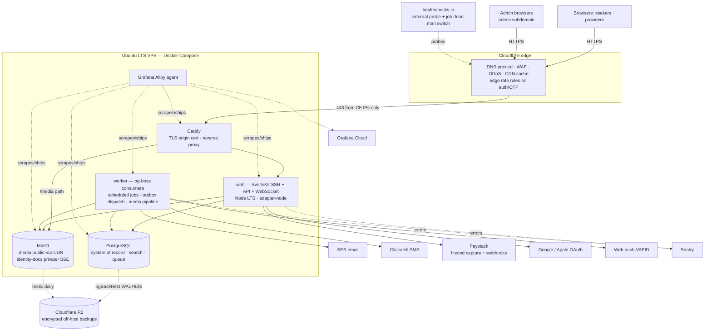
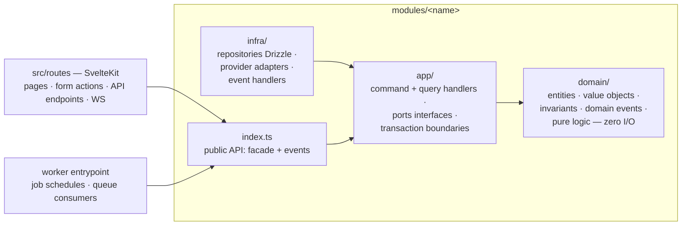
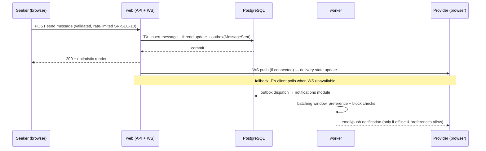

# Solution Architecture / High-Level Design (HLD)

## 1. Document Control

| Field | Value |
|---|---|
| Product | Peach Finder |
| Document | Solution Architecture / High-Level Design |
| Owner | Kumbirai (kumbirai@gmail.com) |
| Upstream | `00-business-requirements/brd.md`, `01-functional-requirements-specification/frs.md` (signed-off), `02-system-requirements-specification/srs.md`, `03-user-stories/user-stories.md` (assumptions accepted) |
| Downstream | `05-low-level-design`, `06-ui-ux-design`, `08-development-deliverable-documents` |
| Companion | `clean-code-guidelines-per-module.md` (same folder) — developer-facing rules that make this architecture hold in code |
| Status | Living document — updated in place as decisions evolve; see repo history for change record |

**What this document is:** the technical approach for Peach Finder V1 — the architectural pattern, the technology selections deferred here by SRS D-4, the decomposition into modules, the runtime and deployment topology, and how the SRS quality attributes are satisfied. It gives the full picture of how the system is structured **without implementation detail** — schemas, endpoint signatures, and class designs belong to `05-low-level-design`.

**Inherited binding stances (restated because the architecture must never violate them):**

- **Moderation is a human function with no system gating** (FRS §1, SRS §1). Nothing in this architecture performs automated content analysis, filtering, or gating. Upload validation is technical-only; rate limits are resource-level.
- **W-guards:** no booking calendar, no recommendation engine, no on-platform service payments, no automated moderation. These are honored by omission — no component below exists to serve them.
- **Fixed platform constraints (SRS §4):** single Ubuntu LTS VPS, Docker containers, behind Cloudflare, media in local MinIO.

---

## 2. Architectural Pattern

### HLD-DEC-01 — Feature-oriented modular monolith

Peach Finder V1 is a **single deployable codebase organized as a feature-oriented modular monolith**, combining four ideas — each applied *lightly*, for its benefit, without the ceremony or operational overhead of a distributed system:

| Ingredient | What we take from it | What we deliberately don't take |
|---|---|---|
| **DDD** | Bounded contexts as modules with explicit ownership of data and language; aggregates guard invariants; a small shared kernel | No event sourcing, no context-per-database, no strategic-design bureaucracy |
| **Clean / Hexagonal Architecture** | Dependency rule per module: domain ← application ← (infrastructure, delivery). Domain code imports nothing but itself and the shared kernel. External services live behind ports/adapters (SR-INT preamble made this a requirement) | No layer-per-Jar packaging theater; layers are folders + lint-enforced import rules, not deployment units |
| **Lightweight CQRS** | Use cases are explicit **command** and **query** handlers. Write paths go through aggregates; read-heavy paths (search, dashboards) use purpose-built read models fed by events | No separate read database, no eventual-consistency where a simple transactional query suffices |
| **Internal event bus** | Modules communicate asynchronously through domain events (in-process dispatch + transactional outbox for reliability), so discovery, notifications, analytics, and trust don't couple to each other's internals | No message broker (Kafka/Rabbit). The bus is a library over PostgreSQL |

**Why this shape.** The SRS demands one-person ops on one box (D-1, SR-CAP-04) and a launch scale (SR-CAP-01) that a single process serves with an order of magnitude of headroom. Microservices would multiply failure modes without buying anything. But a *ball-of-mud* monolith would make the eventual V2 evolution (new verticals reusing the generic profile/search/trust model — BRD §6) expensive. The modular monolith is the deliberate midpoint: **module boundaries are enforced like service boundaries (by tooling), while deployment stays one unit.** SR-CAP-04's "don't bake in assumptions that prevent a later tier split" is satisfied because modules already talk through interfaces and events.

### HLD-DEC-02 — Two processes, one image

The codebase produces **one container image with two entrypoints**:

- **`web`** — SvelteKit SSR + JSON API + WebSocket endpoint. Serves all human traffic.
- **`worker`** — scheduled jobs (SR-APP-10) + async queue consumers (outbox dispatch, notifications, media processing, analytics rollups).

Same code, same modules, same migrations — only the entrypoint differs. This keeps the SR-APP-10 sweeps and queue processing out of the request path's CPU budget while adding zero build complexity. Either process can be scaled or split to another host later without code change (SR-CAP-04).

---

## 3. Technology Selection (closes SRS D-4)

The SRS deferred product selection here. The options analysis behind these picks is recorded in the vault note `projects/peach-finder/stack-selection-discussion.md`; this section is the decision record.

### HLD-DEC-03 — Application platform: TypeScript end-to-end, SvelteKit 2 on Node.js LTS

**Ratified by owner (2026-07-22): full-TypeScript monolith.** Within that, **SvelteKit 2 (Svelte 5) on the current Node.js LTS**, deployed via `adapter-node` on a custom Node server (needed to attach the WebSocket upgrade handler).

- SvelteKit is SSR-first by design — SR-APP-01 (server-rendered public surfaces) and SR-PERF-05 (≤ 300 KB compressed JS) are its native operating mode. Svelte's compiled output ships the smallest hydration payload of the mainstream frameworks, making the JS budget comfortable rather than contested.
- One language across UI, API, domain logic, and jobs — one toolchain, one test runner, one mental model for a solo-operated codebase.
- **Next.js is the named fallback**, not a parallel option: if a hard blocker emerges in SvelteKit (ecosystem gap, hiring), the module layout below is framework-agnostic by construction — only the delivery layer (`src/routes`) would be rewritten.
- TypeScript in **strict** mode everywhere; the compiler is the first line of defense for SR-APP-12-class correctness. Details in the clean-code guidelines.

Backend rigor (transactions, idempotency, RBAC on every route) is convention-by-discipline in Node rather than framework-enforced — that is the known cost of this pick, and it is exactly what the companion clean-code guidelines and the lint-enforced module rules exist to pay down.

### HLD-DEC-04 — Data platform: PostgreSQL as system-of-record, search engine, and queue

**PostgreSQL (current stable major) is the only stateful service besides MinIO.** It plays three roles, each behind a module boundary so it can be replaced independently if scale ever demands:

| Role | Mechanism | Why not a dedicated product |
|---|---|---|
| System of record (SR-DATA-01) | ACID transactions, referential integrity, WAL-based PITR | It *is* the dedicated product |
| Search index (SR-APP-03) | Built-in FTS + `pg_trgm` trigram indexes over a denormalized search projection; ranking rules (availability-first, featured caps) are deterministic `ORDER BY` logic | At 2,000 documents, Meilisearch/Typesense/Elastic add a container, a sync pipeline, and a second home for ranking rules — for zero measurable benefit against the SR-PERF budgets. SR-AVL-06's "search down → filtered listing" degradation becomes nearly moot |
| Job queue + outbox transport (SR-APP-07/08/10/12) | **pg-boss** (`SELECT … FOR UPDATE SKIP LOCKED` under the hood): retries, backoff, cron scheduling, dead-letter | 20 msg/s-class volume is trivial; queue state shares the domain's transactions (an outbox insert commits atomically with the state change) and the same backup/PITR |
| Presence + rate counters | Unlogged tables (no WAL cost) | Redis would be a second stateful service to run, back up, and monitor. **No Redis at launch** — it is the *first* optimization if profiling ever demands it, and it's a one-container addition, not a redesign |

Geo: the gazetteer is areas-with-centroids (SR-INT-06); haversine distance in SQL suffices — **no PostGIS in V1**.

Data access: **Drizzle ORM** (schema-as-code, SQL-transparent, generates versioned forward-only SQL migrations per SR-DATA-06). SQL-first matters here because the discovery ranking rules are SQL and must stay legible. (Library-level picks in this section are indicative; substitutions of equivalent libraries are LLD-level decisions.)

### HLD-DEC-05 — Media pipeline: sharp (libvips) with HEIF support

Upload processing (SR-MEDIA-02/03) runs in the **worker** via `sharp` built with libvips + libheif: content-sniffed decode (JPEG/PNG/WebP/HEIC), **mandatory EXIF/GPS strip**, WebP-first responsive variants (320/640/1280/2048), content-hashed immutable object names into MinIO's `media` bucket. No on-the-fly image proxy — variants are pre-generated and immutable, so Cloudflare caches them indefinitely (SR-MEDIA-04).

### HLD-DEC-06 — Realtime: in-app WebSockets

Messaging transport (SR-APP-05) is a WebSocket endpoint in the `web` process (`ws` library attached to the Node server), with automatic client reconnection and **polling fallback** (SR-COMPAT-03). At 1,000 peak concurrent on a single origin there are no sticky-session or fan-out-scale concerns; a dedicated realtime service is unjustified.

### HLD-DEC-07 — Edge & origin: Cloudflare + Caddy with an Origin CA certificate

Cloudflare provides DNS (proxied only), WAF, DDoS, edge caching, and edge rate rules on auth/OTP paths (SR-INT-07). On the VPS, **Caddy** terminates TLS with a **Cloudflare Origin CA certificate** (15-year validity — no renewal automation to break) satisfying Full (strict) (SR-SEC-01), and reverse-proxies to the `web` container and MinIO's public media path. Host firewall admits 80/443 from Cloudflare IP ranges only, refreshed automatically (SR-SEC-02).

### HLD-DEC-08 — Observability: off-host by default

The VPS is the single point of failure; **alerting that dies with the host is not alerting**. The observability stack is therefore external SaaS on free/near-free tiers, fed by one lightweight agent container:

| Concern | Product | SRS |
|---|---|---|
| Metrics + logs + dashboards + alerts | **Grafana Cloud** (free tier covers this scale) via a single Grafana Alloy agent container | SR-OBS-01/02/03 |
| Error tracking (server + client, release-tagged) | **Sentry** (or self-hosted GlitchTip if cost ever bites) | SR-OBS-06 |
| External uptime probe + cron dead-man's-switch | **healthchecks.io** — every SR-APP-10 job pings on success; a missed window alerts. Uptime probe runs from outside Cloudflare/VPS as SR-OBS-03 requires | SR-OBS-03 |

Real-user performance metrics (SR-PERF-07) ship from the client to the app's own first-party endpoint (SR-PRIV-04 — no third-party trackers) and onward into Grafana Cloud.

### HLD-DEC-09 — Backup & recovery: pgBackRest + restic to off-host object storage

- **PostgreSQL:** pgBackRest — WAL archiving (continuous) + daily fulls, direct to **Cloudflare R2** (no egress fees, already in the Cloudflare relationship; Backblaze B2 is the named alternate). Meets RPO ≤ 1 h with margin; PITR per SR-AVL-03.
- **MinIO buckets + host config:** restic (client-side encrypted) to the same off-host storage, daily. `identity-docs` backups inherit the live bucket's encryption; the ≤ 35-day backup retention window satisfies purge propagation (SR-AVL-03).
- Quarterly restore drill against a scratch environment per SR-AVL-05, scripted as part of the runbooks (SR-OPS-05).

### HLD-DEC-10 — CI/CD: GitHub Actions → GHCR → scripted SSH deploy

Every push: test suite, lint + module-boundary checks, bundle-size budget check (SR-PERF-05 as a CI gate), Trivy dependency/image scan (SR-SEC-06), image build → GHCR. Deploy is a single scripted operation over SSH: `compose pull` → run migrations → roll containers behind a health-check gate; failed health check halts rollout; rollback = previous image tag (SR-OPS-02/03). Host provisioning is an idempotent script (SR-OPS-04). Git is initialized on `main` and tracks `https://github.com/kumbirai/peach-finder.git` (closed 2026-07-23).

### HLD-DEC-11 — Hosting location: South-Africa origin

SRS D-6 is **owner-confirmed (2026-07-22)**: South Africa launch market, POPIA regime. The VPS is provisioned with a **South-African hosting provider** (xneelo / Host Africa class, or AWS af-south-1 at higher cost), sized ≥ 4 vCPU / 8 GB / 160 GB NVMe (SR-CAP-03). Rationale: ~150–180 ms of EU-origin RTT would consume a third of the 500 ms SSR budget on every dynamic request (Cloudflare's JNB/CPT edges can't cache discovery HTML past the 60 s freshness bound, SR-PERF-06), and SA hosting avoids the POPIA §72 cross-border transfer write-up entirely.

### HLD-DEC-12 — External providers (all behind adapter ports)

| Port | Selected | Alternates kept warm | Notes |
|---|---|---|---|
| Payments (SR-INT-03) | **Paystack** | PayFast, Peach Payments, Yoco | Stripe does not onboard ZA-domiciled merchants, so the short-list is SA-capable PSPs. Paystack (Stripe-owned) **verified by owner (2026-07-22)**: ZA recurring billing, signed webhooks, SAQ-A hosted capture confirmed — billing integration is unblocked. (Brand note: "Peach Payments" is a real SA PSP — a naming-collision consideration for the product, tracked in BRD risks.) |
| SMS OTP (SR-INT-02) | **Clickatell** | BulkSMS, Twilio | SA-local aggregators beat Twilio on ZA delivery rates and price; verify deliverability across ZA networks in staging |
| Transactional email (SR-INT-01) | **Amazon SES** | Postmark, Resend | Cheapest at volume; SPF/DKIM/DMARC configured regardless of vendor |
| OAuth (SR-INT-04) | Google (M), Apple (S) | — | Commodity; per SRS D-7 |
| Web push (SR-INT-05, S) | Standard VAPID | — | Library-level |
| Gazetteer (SR-INT-06) | GeoNames ZA extract → local `Area` table | OSM extract | One-time import; locally owned, nothing on the search hot path |

Every one of these is a port with exactly one production adapter and one fake adapter (for tests/staging). A provider swap is an adapter + config change — the SR-INT preamble is an enforced property, not an aspiration.

---

## 4. System Context (C4 Level 1)

The SRS §2.1 context diagram remains authoritative. Summary: mobile-first browsers (anonymous seekers, seekers, providers) and admins reach the platform exclusively through Cloudflare; the VPS hosts the web tier, worker, PostgreSQL, and MinIO; outbound integrations are email, SMS, PSP, OAuth, and web push; backups replicate off-host.

---

## 5. Container View (C4 Level 2)

Container inventory and steady-state resource budget (SR-CAP-02: ≤ 60 % of 8 GB):

| Container | Image | RAM budget | Notes |
|---|---|---|---|
| caddy | caddy:2 | 128 MB | TLS, proxy, static |
| web | app image, `web` entrypoint | 768 MB | SSR + API + WS |
| worker | same app image, `worker` entrypoint | 512 MB | jobs, queues, media (sharp peaks bounded by concurrency limit) |
| postgres | postgres current-stable | 1.5 GB | includes shared buffers |
| minio | minio latest-stable | 512 MB | two buckets |
| alloy | grafana/alloy | 256 MB | metrics + logs shipping |
| **Total** | | **≈ 3.7 GB ≈ 46 %** | inside SR-CAP-02 headroom |

The admin console is **not a separate container**: it is a route group in the `web` app served on a distinct subdomain (SR-SEC-08), with its own session policy, mandatory TOTP, and eligibility for Cloudflare Access hardening — one codebase, one deployment, hard server-side privilege separation (SR-SEC-05).

---

## 6. Application Architecture (C4 Level 3) — the modules

### 6.1 Module map

Modules are bounded contexts derived from the FRS module map, adjusted where the FRS split follows document convenience rather than domain ownership (e.g. FRS "TRUST" and "ADM" share one moderation domain; "UX" is not a module but a set of cross-cutting budgets).

**Naming registry.** Each bounded context has one kebab-case name. That name is the module folder, the facade prefix, the config-key namespace, and the future extractable `{context}-service`. PostgreSQL schema names are the same identifier in snake_case (hyphens are illegal in unquoted Postgres identifiers). HTTP resource paths (`/api/media/…`, `/api/provider/…`), MinIO buckets (`media`, `identity-docs`), RBAC capabilities (`seeker` / `provider` / `admin`), and FRS/SRS/US IDs are **not** context names and do not change when a context is extracted.

| Context (kebab) | Postgres schema | Module path | Future extract |
|---|---|---|---|
| `identity-and-access` | `identity_and_access` | `src/lib/server/modules/identity-and-access/` | `identity-and-access-service` |
| `provider-profile` | `provider_profile` | `src/lib/server/modules/provider-profile/` | `provider-profile-service` |
| `provider-availability` | `provider_availability` | `src/lib/server/modules/provider-availability/` | `provider-availability-service` |
| `discovery-search` | `discovery_search` | `src/lib/server/modules/discovery-search/` | `discovery-search-service` |
| `direct-messaging` | `direct_messaging` | `src/lib/server/modules/direct-messaging/` | `direct-messaging-service` |
| `provider-reviews` | `provider_reviews` | `src/lib/server/modules/provider-reviews/` | `provider-reviews-service` |
| `trust-and-safety` | `trust_and_safety` | `src/lib/server/modules/trust-and-safety/` | `trust-and-safety-service` |
| `listing-billing` | `listing_billing` | `src/lib/server/modules/listing-billing/` | `listing-billing-service` |
| `provider-analytics` | `provider_analytics` | `src/lib/server/modules/provider-analytics/` | `provider-analytics-service` |
| `user-notifications` | `user_notifications` | `src/lib/server/modules/user-notifications/` | `user-notifications-service` |
| `media-processing` | `media_processing` | `src/lib/server/modules/media-processing/` | `media-processing-service` |
| `platform-configuration` | `platform_configuration` | `src/lib/server/modules/platform-configuration/` | `platform-configuration-service` |
| `shared-kernel` | `shared` | `src/lib/server/shared/` | library, not a service |
| `moderation-admin` | — | `src/routes/admin/` | delivery surface, not extracted |

| Module | Owns (state + language) | Delivers FRS | Key events published |
|---|---|---|---|
| `identity-and-access` | User accounts, credentials (Argon2id), sessions, OAuth links, email/phone verification (OTP), password reset, roles | ACC | `UserRegistered`, `EmailVerified`, `PhoneVerified`, `AccountDeletionRequested` |
| `provider-profile` | ProviderProfile aggregate, services & curated tag vocabulary, languages, photos (metadata), publish state | PROF | `ProviderPublished`, `ProviderUnpublished`, `ProfileUpdated`, `PhotoAdded/Removed` |
| `provider-availability` | AvailabilityStatus + history, auto-expiry; exposes its own activity signal to `trust-and-safety` (does not own the "active this week" OR) | AVAIL | `AvailabilitySet`, `AvailabilityCleared`, `AvailabilityExpired`, `AvailabilityExpiryWarned` |
| `discovery-search` | Search read model (denormalized projection), deterministic lexicon parser, suggestions, ranking rules, gazetteer-based proximity | SRCH | — (pure read side; consumes events from `provider-profile` / `provider-availability` / `trust-and-safety` / `provider-reviews`) |
| `direct-messaging` | Threads, messages, delivery/read state, presence heartbeats + coarse last-seen, response-time stats | MSG | `ThreadCreated`, `MessageSent`, `MessageRead` |
| `provider-reviews` | Reviews, provider replies, rating aggregates, eligibility (≥ 24 h thread rule) | REV | `ReviewSubmitted`, `ReviewReplied`, `RatingAggregateChanged` |
| `trust-and-safety` | Identity-verification cases, the two V1 badge states (identity verified, active this week — never a highly-rated badge; that is a search filter, FR-REV-05), reports, moderation actions, blocks | TRUST + ADM (moderation domain) | `VerificationDecided`, `BadgeGranted`, `BadgeRevoked`, `ReportFiled`, `ReportResolved`, `ModerationActionTaken`, `UserBlocked`, `UserUnblocked` |
| `listing-billing` | Subscriptions (listing, featuring), free-period lifecycle, invoices/receipts, PSP webhook processing, dunning state | MONET | `TrialStarted`, `SubscriptionActivated`, `PaymentSucceeded`, `PaymentFailed`, `GraceEntered`, `ListingLapsed` |
| `provider-analytics` | Raw event capture (fire-and-forget), dedup, hourly rollups, provider dashboard aggregates with < 5 floor | ANLY | — (terminal consumer) |
| `user-notifications` | Fan-out policy, per-user preferences, burst batching, block silence; channel adapters: email, SMS, web push, in-app | NOTIF | `NotificationDispatched` (for delivery-health metrics) |
| `media-processing` | Upload intake, technical validation, processing pipeline, MinIO adapter, presigned-URL issuance for identity-docs | supports PROF/MSG/TRUST | `MediaProcessed`, `MediaRemoved` |
| `platform-configuration` | Runtime configuration (FR-ADM-06 settings, pricing, lexicon data), area gazetteer reference data, data-export (SR-DATA-07) | ADM (config), PRIV (export) | `ConfigChanged` |
| `shared-kernel` | ID types, Result/error types, clock, event-bus + outbox library, audit-log writer (append-only), auth context, Zod helpers | — | — |

Cross-cutting FRS modules map as follows: **UX** → performance budgets and accessibility gates enforced in CI and the delivery layer; **PRIV** → retention jobs live in the owning module (e.g. thread purge in `direct-messaging`, identity-doc purge in `trust-and-safety`), coordinated by the worker scheduler; the *rules* are stated here and detailed per-module in LLD.

The **admin console is a delivery surface, not a module**: admin routes call application services of `trust-and-safety`, `listing-billing`, `platform-configuration`, and `identity-and-access`. Moderation *domain logic* lives in `trust-and-safety`.

### 6.2 Module internal structure (hexagonal, enforced)

Every module has the same anatomy; the arrows are the only legal import directions:

- `domain/` imports nothing except `shared-kernel` types. No framework, no Drizzle, no fetch.
- `app/` defines **ports** (interfaces) for everything it needs (repositories, PSP, mailer, clock); handlers orchestrate domain objects inside an explicit transaction boundary.
- `infra/` implements the ports; it is the only layer that knows Drizzle, MinIO, Paystack, etc.
- **`index.ts` is the module's only public surface.** Other modules import the facade and the event types — never `domain/`, `app/` internals, or `infra/` of another module.
- The delivery layer (`src/routes`) and the worker entrypoint are thin: parse/validate input (Zod), call a handler, shape the response. No business logic, no SQL.

**Enforcement is tooling, not culture:** `dependency-cruiser` (or `eslint-plugin-boundaries`) rules codify every arrow above and run in CI as a blocking check — the modular monolith's boundaries are exactly as strong as this gate.

### 6.3 Inter-module communication rules

1. **Synchronous query/command** — allowed only through another module's public facade (e.g. `provider-reviews` asks `direct-messaging` "does an eligible ≥ 24 h thread exist between these users?"). Used when the caller needs an answer *now* and consistency matters.
2. **Asynchronous domain events** — the default for "something happened, others may care." Publisher commits an outbox row **in the same transaction** as its state change; the worker's outbox dispatcher delivers to subscribers via pg-boss with at-least-once semantics; **every handler is idempotent** (SR-APP-12).
3. **Shared database, private tables** — one PostgreSQL database; each module owns a **PostgreSQL schema that is the snake_case of its kebab context name** (`identity_and_access.*`, `provider_profile.*`, … — see §6.1 naming registry). Cross-schema foreign keys are allowed **only** onto `identity-and-access`'s `user` id and `platform-configuration`'s `area` id (stable reference aggregates); all other cross-module references are plain IDs resolved through facades. This keeps referential integrity where it protects real invariants without welding contexts together.
4. **No synchronous chains for side effects.** A command handler never calls another module's *command* synchronously (money paths excepted only where the SRS demands transactional coupling — badge grant + audit log per SR-APP-12). Side effects ride events.

### 6.4 Lightweight CQRS in practice

- **Commands** mutate exactly one aggregate per transaction, append audit-log entries in the same transaction where required (SR-APP-12), and enqueue outbox events.
- **Queries** never go through aggregates. Two read-model patterns are sanctioned:
  - **Transactional reads** (profile page, thread list): straightforward SQL views/queries over owning-module tables — no projection machinery.
  - **Event-fed projections** where the SRS demands denormalized speed or decoupling: the **discovery search projection** (one row per published provider: tsvector, trigram fields, area centroid, availability flags + timestamps, badge flags, rating aggregate, featured flag — updated by events from `provider-profile`/`provider-availability`/`trust-and-safety`/`provider-reviews`/`listing-billing` within the ≤ 30 s SR-APP-03 bound) and the **analytics aggregates** (hourly rollups per SR-APP-08).
- Ranking (FR-SRCH-03/08c) is deterministic SQL over the projection: availability-first ordering, featured-never-outranks-available, then relevance/distance/rating tiebreaks. **No scoring engine, no learning, no per-user state** (SRS D-5, FR-SRCH-13).

### 6.5 The internal event bus

A `shared-kernel` library, not an infrastructure product:

- **Publish:** `publish(event)` inside a command's transaction writes `shared.outbox` (event name, version, payload of IDs + facts, occurred-at). Commit makes it durable — an event can never exist without its state change, or vice versa.
- **Dispatch:** the worker polls the outbox (pg-boss job), fans out one pg-boss job per (event, subscriber) with retry/backoff and dead-letter after N attempts (alerting per SR-OBS-03).
- **Subscribe:** modules register handlers by event name in their `infra/` layer. Handlers are idempotent (natural keys / processed-event ledger) and isolated — one subscriber's failure never blocks another's.
- **In-process synchronous handlers** are reserved for the audit log alone (same-transaction requirement, SR-APP-12); everything else is async.
- Event payloads carry **IDs and immutable facts, never entity snapshots** — subscribers fetch current state through facades if they need it, avoiding stale-payload bugs.

---

## 7. Runtime View — key flows

### 7.1 Search (anonymous seeker, SSR)

Request → Cloudflare (cache miss or > 60 s stale per SR-PERF-06) → Caddy → SvelteKit server `load` → `discovery-search` facade: lexicon parser tokenizes free text → structured filters (deterministic, admin-editable lexicon tables cached in-process with ≤ 5 min config TTL per SR-APP-11) → single SQL query over the search projection with ranking `ORDER BY` → SSR HTML (interactive ≤ 3 s / server p95 ≤ 500 ms per SR-PERF-01). Suggestions hit a pre-warmed trigram query (server p95 ≤ 100 ms, SR-PERF-02). Device coordinates, when granted, ride the request and are never persisted (FR-PRIV-02).

### 7.2 Message send

End-to-end delivery to an online counterpart ≤ 2 s p95 (SR-PERF-04); the WS push happens post-commit in the same request, the notification path is fully async and its failure degrades that channel only (SR-AVL-06).

### 7.3 Billing webhook (idempotent money path)

Paystack webhook → `web` endpoint: verify signature → look up event ID in `listing_billing.processed_webhooks` (idempotency ledger) — duplicate: 200 and stop → TX: subscription state transition + invoice record + audit-log entry + outbox (`PaymentSucceeded`/`PaymentFailed`) → commit → 200. Grace/lapse/dunning progression is driven by the daily billing job re-deriving state from stored facts (SR-APP-10), so a missed webhook heals. A PSP outage blocks new purchases but never unpublishes anyone (SR-AVL-06).

### 7.4 Photo upload

`web` accepts the upload (auth + ownership + size/count checks), streams the original to a MinIO staging prefix, enqueues `media-processing.process`. Worker: content-sniff decode → **strip all EXIF/GPS** → encode WebP-first variants → content-hashed names into `media` bucket → TX: photo metadata + outbox(`MediaProcessed`) → discovery projection update. Failure surfaces to the owner as a plain-language retryable error; no content judgment anywhere (SR-MEDIA-02).

### 7.5 Availability auto-expiry

Worker cron (every minute, pg-boss): a warning tick publishes per-row `AvailabilityExpiryWarned` (renewal prompt via `user-notifications`, FR-AVAIL-03); a separate expiry statement then expires overdue statuses (UTC timestamps, SR-APP-04) → per-row outbox(`AvailabilityExpired`) → projection updates (≤ 30 s visibility). Expiry itself does not notify. Job pings healthchecks.io on success — a silent miss alerts within the dead-man window. An expired status never survives past expiry + 60 s.

---

## 8. Data Architecture

- **One PostgreSQL database, one schema per module** (§6.3). The SR-DATA-02 entity list maps onto owning modules per the §6.1 table; the full logical model is LLD scope.
- **Migrations:** Drizzle-generated versioned forward-only SQL, executed by the deploy script before container rollover (SR-DATA-06, SR-OPS-03), rehearsed against staging first.
- **Audit log (SR-DATA-05):** `shared.audit_log`, written only by the shared-kernel writer inside the acting command's transaction. The application role has `INSERT`/`SELECT` only — `UPDATE`/`DELETE` are revoked at the database level, making append-only a property of the platform, not a convention.
- **Retention & purge (SR-DATA-03):** each owning module ships its purge job (identity-doc purge in `trust-and-safety`, thread purge in `direct-messaging`, anonymization in `identity-and-access`, raw-event destruction in `provider-analytics`); all run on the worker scheduler, log outcomes, and ping their health checks (SR-PRIV-05). Deletion is anonymization where the FRS requires survivorship (SR-DATA-04).
- **Search projection freshness:** event-driven updates well inside the ≤ 30 s bound, plus a reconciling sweep (hourly) that rebuilds drifted rows — self-healing beats "should never happen."
- **Unlogged tables** for presence heartbeats and rate-limit counters: crash loss is acceptable by design; they are excluded from backup concerns.
- **MinIO:** `media` (public read via Caddy/CDN path only) and `identity-docs` (SSE-encrypted, private, presigned GET ≤ 5 min issued exclusively to authenticated admin sessions; issuance audit-logged) per SR-MEDIA-01.

---

## 9. Deployment View

- **Environments (SR-OPS-01):** `staging` and `production`, identical images, config via env/secret files only. Staging data is sanitized — never real identity documents or message content.
- **Compose topology:** the §5 container inventory in one version-controlled compose file; two Docker networks — `edge` (caddy ↔ web, caddy ↔ minio media path) and `internal` (web/worker ↔ postgres/minio). PostgreSQL and MinIO have **no published host ports** (SR-SEC-02).
- **Deploy sequence (SR-OPS-03):** CI green (tests, boundaries, bundle budget, Trivy) → image to GHCR → `deploy.sh`: pull → migrate → restart `worker` → health-gate → restart `web` → health-gate → smoke probe through Cloudflare. Failure at any gate halts; rollback = redeploy previous tag (≤ 15 min, documented). Brief < 60 s interruption accepted in V1; zero-downtime rolling is (S).
- **Host provisioning as code (SR-OPS-04):** one idempotent script — Docker, UFW with auto-refreshed Cloudflare ranges, SSH hardening (key-only, IP-restricted), unattended security upgrades, restic + pgBackRest config, Alloy — bringing a replacement host to service within the RTO.
- **First-run bootstrap (SR-OPS-07):** seeded by migration + bootstrap job: admin account with forced TOTP enrollment, FR-ADM-06 config defaults, service-tag vocabulary, lexicon seed, gazetteer import.

---

## 10. Cross-Cutting Concerns

### 10.1 Security (mechanism map)

| SRS | Mechanism in this architecture |
|---|---|
| SR-SEC-01/02/03 | Cloudflare Full (strict) + Caddy Origin CA cert; UFW Cloudflare-ranges-only; SSH key-only; client IP taken from `CF-Connecting-IP` only when the TCP peer is a Cloudflare range |
| SR-SEC-04 | Argon2id password hashing; server-side session table (revocable, 90-day rolling "keep me signed in"); re-auth + other-session revocation on credential change; uniform anti-enumeration responses |
| SR-SEC-05 | RBAC middleware in the SvelteKit server hook resolves the auth context once per request; every route declares its required role; ownership checks live in application-layer handlers (never in UI); blocks enforced in queries |
| SR-SEC-06 | SvelteKit CSRF origin checking + form tokens; CSP and security headers set at the hook; Drizzle parameterization; SSRF-safe outbound fetch wrapper in shared-kernel; Trivy in CI, criticals block release |
| SR-SEC-07 | Secrets via env/secret files outside images; rotation is config-only |
| SR-SEC-08 | Admin = separate subdomain route group: mandatory TOTP, ≤ 12 h idle timeout, all actions audit-logged, Cloudflare Access eligible |
| SR-SEC-09/OBS-05 | Privacy filtering server-side in query/serialization layer — a response object that a role shouldn't see is never constructed; log serializers mask emails/phones and never log message bodies, tokens, OTPs, or identity-doc data |
| SR-SEC-10 | Cloudflare edge rules on auth/OTP + app-level sliding-window counters (Postgres unlogged table, `security-implementation.md` §5) on auth, OTP, resets, sends, thread creation, reviews, reports, search. Resource-level only; throttled users are never flagged or reported (SR-SEC-11) |

### 10.2 Privacy by construction (SR-PRIV-02)

Enforced at architectural chokepoints, not per-feature discipline: no address fields exist in the schema (area IDs only); device coordinates are request-scoped parameters with no persistence path; presence coarsening happens in the presence read facade — no API returns raw timestamps; the < 5 analytics floor is applied in the dashboard query layer; EXIF stripping is unconditional in the one media pipeline all uploads pass through.

### 10.3 Configuration subsystem (SR-APP-11)

`platform-configuration` module owns typed config in the database; admin edits publish `ConfigChanged`; web/worker processes hold an in-process cache invalidated by event (with a ≤ 5 min TTL backstop). No restarts, no deploys. The search lexicon and pricing ride the same mechanism.

### 10.4 Observability wiring

Structured JSON logs (request-ID correlated across web → outbox → worker via a propagated correlation ID) → Alloy → Grafana Cloud (≥ 30 days). Metrics: HTTP latency percentiles tagged against SR-PERF budgets, WS connection count, queue depths + job outcomes, DB/host vitals. Every SR-APP-10 job = one healthchecks.io check. Alert rules per SR-OBS-03 with runbook links (SR-OPS-05). Sentry captures server + client errors tagged by release; new-error regression alerts.

---

## 11. Quality-Attribute Satisfaction (SRS → architecture)

| SRS category | Satisfied by |
|---|---|
| INT | §3 HLD-DEC-12 adapter ports; async email/notification via queue (outage never blocks user action) |
| CON | §5, §9 — single VPS, Compose, Cloudflare, MinIO exactly as mandated |
| APP | SSR (HLD-DEC-03); deterministic parser + projection (§6.4, §7.1); WS + fallback (HLD-DEC-06); presence/notifications/analytics/jobs (§6.1, §7.5); runtime config (§10.3); idempotency + outbox (§6.5, §7.3) |
| DATA | §8 — single ACID store, schema-per-module, migrations, append-only audit, retention jobs |
| MEDIA | HLD-DEC-05, §7.4, §8 — pipeline, buckets, immutable CDN delivery |
| PERF | SSR-first framework + minimal hydration (300 KB budget as CI gate); indexed projection queries; 60 s discovery cache bound honored at Cloudflare page rules + app cache headers; budgets monitored via RUM (§10.4) |
| CAP | §5 resource budget ≈ 46 % of 8 GB; vertical-first scaling; queues absorb spikes; friendly-busy degradation |
| AVL | HLD-DEC-08/09 — off-host alerting + backups, PITR, quarterly drills; §7.3/SR-AVL-06 degradation orders designed in |
| SEC | §10.1 |
| PRIV | §10.2; POPIA posture + SA hosting (HLD-DEC-11); SAQ-A via hosted capture |
| OBS | HLD-DEC-08, §10.4 |
| OPS | HLD-DEC-10, §9 |
| COMPAT | SSR + progressive enhancement (SvelteKit forms work pre-hydration, SR-COMPAT-03); CI accessibility checks + manual passes (SR-COMPAT-04); mobile-device performance verified per SR-COMPAT-02 |

---

## 12. Risks & Trade-offs (accepted)

| Risk / trade-off | Position |
|---|---|
| Single host remains the availability ceiling | Accepted per SRS D-2; mitigated by off-host backups/alerts + provision-as-code RTO |
| Node/SvelteKit backend rigor is discipline-enforced, not framework-enforced | Paid down by clean-code guidelines + lint-enforced boundaries + CI gates; this is the priced-in cost of the ratified full-TS decision |
| Postgres-as-search caps relevance sophistication | At 2k documents ranking is rule-driven, not relevance-driven; `discovery-search` facade isolates a future engine swap |
| pg-boss couples queue throughput to the primary DB | Orders of magnitude of headroom at design point; first pressure valve is Redis/queue extraction, a bounded change |
| SvelteKit ecosystem is thinner than React's | Named fallback (Next.js) touches only the delivery layer by construction |
| Modular boundaries can erode under deadline pressure | The dependency-cruiser CI gate is non-negotiable; boundary violations are build failures, not review comments |

---

## 13. HLD-Level Decisions & Assumptions (flagged for review)

Reversible at this level; listed so sign-off is informed. HLD-DEC-01..12 above are the decision register; the items below are the *assumptions* those decisions lean on:

| # | Assumption | Leaned on by | If overturned |
|---|---|---|---|
| ~~A-1~~ | **Resolved 2026-07-22:** SRS D-6 owner-confirmed — South Africa launch market, POPIA regime | HLD-DEC-11/12 now rest on a confirmed decision, not an assumption | — |
| ~~A-2~~ | **Resolved 2026-07-22:** Paystack verified by owner (recurring billing, signed webhooks, SAQ-A hosted capture) — billing work unblocked | HLD-DEC-12 | — |
| ~~A-3~~ | **Resolved 2026-07-22:** SvelteKit over Next.js owner-confirmed (Next.js remains the documented fallback should a hard blocker ever emerge) | HLD-DEC-03 | — |
| ~~A-4~~ | **Resolved 2026-07-22:** free-tier observability (Grafana Cloud + Sentry + healthchecks.io) owner-confirmed for launch | HLD-DEC-08 | — |
| ~~A-5~~ | **Resolved 2026-08-20:** LLD uses Drizzle, pg-boss, sharp, and `ws` as specified; no substitution | HLD-DEC-04/05/06 | Equivalent-library substitution remains an LLD decision if a hard blocker appears; architectural shape unchanged |

---

## 14. Closed in LLD; remaining deployment artifacts

Design items previously deferred here — per-module schemas, API/WS contracts, lexicon/parser, search projection and ranking SQL, state machines, notification batching, session/TOTP, and the module test plan — are written under `05-low-level-design/` (see `00-foundations/lld-index.md`). UI/UX artifacts live in `06-ui-ux-design/`.

Still deferred to `08-development-deliverable-documents` (not design): the compose file, Caddyfile, host-provisioning script, and operational runbooks. Executable fixtures belong in `07-test-artifacts`.
